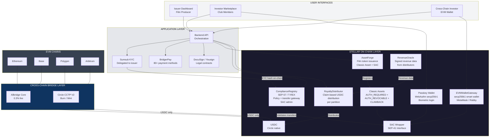
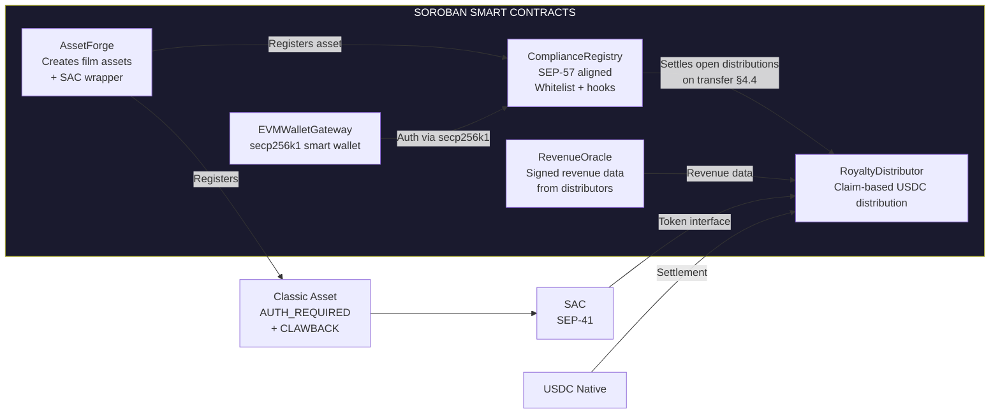
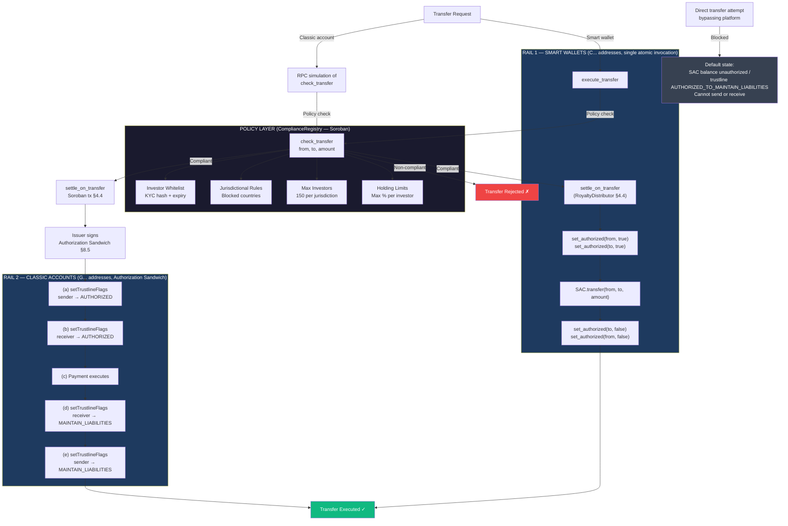
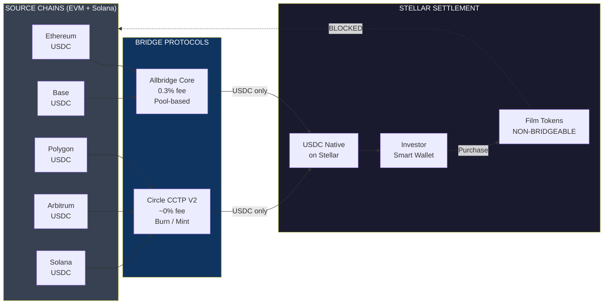
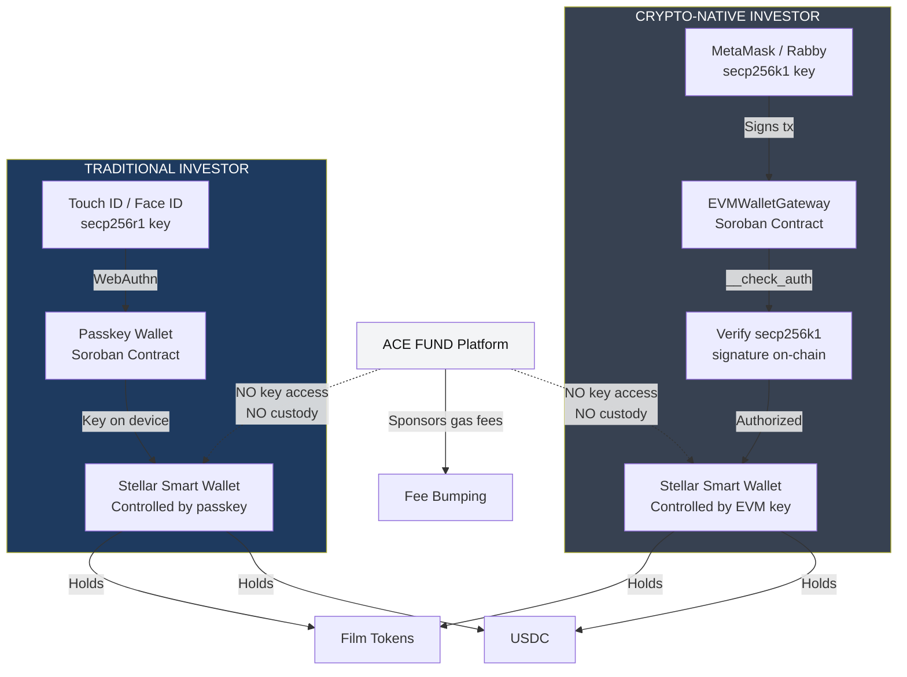
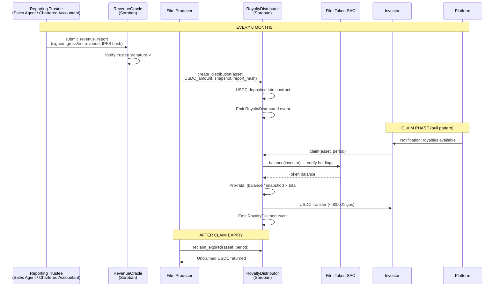
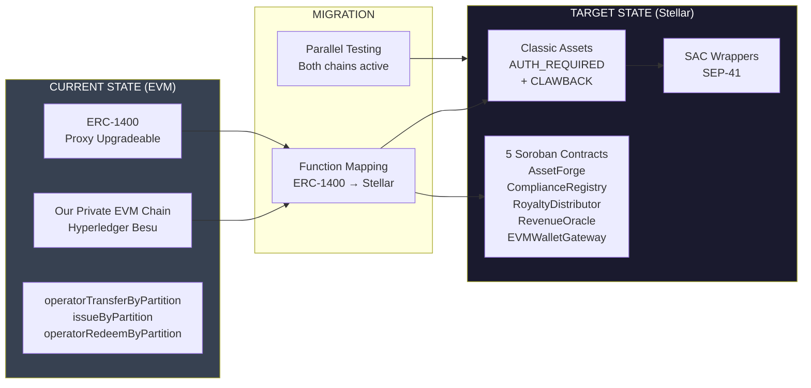

# Technical Architecture — ACE FUND

## Regulated Film Tokenization Rail on Stellar

---

**Project:** ACE FUND (by ACE Good)
**Category:** RWA — Tokenized Film Royalties & Revenue Rights
**Track:** Open Track — Build Award
**Website:** [acefund.io](https://www.acefund.io)

---

## Table of Contents

1. [Executive Summary](#1-executive-summary)
2. [Solution Overview](#2-solution-overview)
3. [Core On-Chain Architecture](#3-core-on-chain-architecture)
4. [Smart Contract Architecture](#4-smart-contract-architecture)
5. [Tokenization Flow](#5-tokenization-flow)
6. [Compliance Architecture](#6-compliance-architecture)
7. [Cross-Chain Liquidity Bridge](#7-cross-chain-liquidity-bridge)
8. [Wallet Architecture](#8-wallet-architecture)
9. [Royalty Distribution Engine](#9-royalty-distribution-engine)
10. [Off-Chain Infrastructure](#10-off-chain-infrastructure)
11. [Security Model](#11-security-model)
12. [ERC-1400 → Stellar Migration Strategy](#12-erc-1400--stellar-migration-strategy)

[Appendix B — ERC-1400 Migration Reference](#appendix-b--erc-1400-to-stellar-migration-reference)
[Appendix C — SEP Alignment](#appendix-c--sep-alignment)

---

## 1. Executive Summary

ACE FUND is a SaaS platform for tokenizing film revenue rights (royalties, box office, TV distribution) as regulated securities. The platform has been operating on a private EVM blockchain (Hyperledger Besu) that we developed, using the ERC-1400 security token standard.

This document describes the technical architecture for migrating and extending this tokenization infrastructure to Stellar, using a hybrid Classic Asset + Soroban smart contract architecture with native compliance enforcement, automated USDC royalty distribution, and cross-chain investor access.

### Why Stellar

- **Protocol-native compliance.** Authorization, freeze, and clawback (`AUTH_REQUIRED`, `AUTH_REVOCABLE`, `AUTH_CLAWBACK_ENABLED`) are enforced by the protocol itself, not by a third-party smart contract (§3.1, §6). For institutional investors, these guarantees are embedded in the infrastructure rather than depending on a contract deployed by an external party.
- **Fees compatible with a 30–40 year horizon.** Royalties are distributed every six months to hundreds of investors for the entire commercial life of a film. On Stellar, each claim in our pull-based distribution model (§4.4) costs less than $0.001 and is fee-bumped by the platform — a full semi-annual distribution cycle for 500 investors settles for under a dollar, making decades of recurring distributions economically viable.
- **Global on/off-ramps through the anchor network.** A growing share of our investors comes from Asia-Pacific, Africa, and Latin America, where reliable local liquidity partners are hard to source. Stellar's anchor network (SEP-6/24, Appendix C) addresses this directly — including MoneyGram for cash access across 174+ countries and Mercuryo for Africa, Latin America, and Eastern Europe.

---

## 2. Solution Overview

Migration from our private EVM blockchain to Stellar public network using a hybrid Classic Asset + Soroban architecture.

### Global Architecture



---

## 3. Core On-Chain Architecture

### 3.1 Asset Model

Each film or catalog is represented as a **Stellar Classic Asset** with the following issuer account configuration:

```
Issuer Account (per film)
├── AUTH_REQUIRED_FLAG         = true
├── AUTH_REVOCABLE_FLAG        = true
├── AUTH_CLAWBACK_ENABLED_FLAG = true
├── Home Domain                = acefund.io
└── Asset Code                 = e.g., FILMREV, MDFCATALOG
```

The Classic Asset is then wrapped via SAC to expose the SEP-41 interface:

```bash
stellar contract asset deploy \
  --source <issuer_keypair> \
  --network mainnet \
  --asset FILMREV:<issuer_public_key>
```

The issuer account's keypair is held by the **film producer** (the legal issuer of the securities), not by ACE FUND. ACE FUND provides the tooling; the producer retains sovereignty.

### 3.2 Partition Model (ERC-1400 Equivalent)

On the existing EVM platform, film tokens use ERC-1400 partitions to separate different tranches of the same film (e.g., "revenue rights" vs "IP rights"). On Stellar, partitions are implemented as **separate Classic Assets issued by the same issuer account**:

```
Film: "Example Film" (Issuer: GFILM...)
├── FILMREV (Revenue Rights) — 300 tokens × €5,000
├── FILMCAT (Catalog Rights) — future tranche
└── Each asset: AUTH_REQUIRED + CLAWBACK + SAC wrapper
```

This preserves the ERC-1400 partition semantics while leveraging Stellar's native asset model. Asset creation and flag configuration are Classic operations executed off-chain (§4.2); the `AssetForge` Soroban contract registers and indexes these partitions on-chain for use by downstream contracts.

---

## 4. Smart Contract Architecture

Five core Soroban contracts orchestrate the on-chain lifecycle:

### 4.1 Contract Overview



### 4.2 AssetForge

**Purpose:** On-chain registry for film token partitions on Stellar. Classic Asset creation and flag configuration are executed off-chain via Stellar SDK/CLI; this contract registers the resulting assets with metadata for use by downstream contracts.

**Functions:**

```rust
pub fn register_film_asset(
    env: Env,
    issuer: Address,          // Film producer (must authorize)
    asset_code: Symbol,       // e.g., "HPREV" (≤12 chars, Symbol for type safety)
    sac_address: Address,     // SAC address (deployed separately via CLI)
    total_supply: i128,       // e.g., 300 tokens
    partition_type: Symbol,   // REVENUE_RIGHTS | CATALOG_RIGHTS | IP_RIGHTS
    metadata_hash: BytesN<32> // IPFS hash of legal contract
) -> Result<(), AssetForgeError> {
    issuer.require_auth();
    // Registers the film asset in the on-chain registry
    // Links SAC address to metadata for downstream contracts
}

pub fn get_film_assets(
    env: Env,
    issuer: Address
) -> Vec<FilmAsset>;
// Returns all partitions for a given film issuer
```

**Important:** Creating a Stellar Classic Asset and setting issuer flags (`AUTH_REQUIRED`, `AUTH_REVOCABLE`, `AUTH_CLAWBACK_ENABLED`) are **Stellar Classic operations**, not Soroban contract calls. These are executed off-chain via the Stellar SDK/CLI before the SAC is deployed. The `register_film_asset()` function registers an already-created Classic Asset + SAC pair in the on-chain registry, linking it to metadata for use by ComplianceRegistry and RoyaltyDistributor.

**Issuance workflow:**
1. **Off-chain (Stellar CLI/SDK):** Create issuer account → set flags → issue Classic Asset → deploy SAC wrapper
2. **On-chain (AssetForge):** `register_film_asset()` records the asset in the contract registry with metadata

**Storage:** Persistent storage maps `issuer → Vec<FilmAsset>` where `FilmAsset` includes asset code, SAC address, total supply, partition type, and creation timestamp.

### 4.3 ComplianceRegistry (SEP-57 / T-REX Aligned)

**Purpose:** On-chain policy registry for investor whitelist and transfer restriction rules. Aligned with the T-REX framework (ERC-3643 adapted to Stellar via SEP-57, currently in draft).

**Important architectural clarification:** The ComplianceRegistry is both the **policy layer** and the **transfer gateway**. The Stellar Asset Contract (SAC) is auto-generated wrapper code that exposes the SEP-41 interface for an underlying Classic Asset — it is not extensible and does not call external contracts on transfer. Enforcement therefore relies on Stellar's native authorization model (`AUTH_REQUIRED`), applied differently depending on the holder type:

- **Contract-held balances (smart wallets, `C...` addresses)** — the standard case on this platform. Investor smart wallets (passkey or EVM gateway) hold film tokens as **SAC contract balances**, not trustlines. Because the asset is `AUTH_REQUIRED`, these balances are unauthorized by default and cannot send or receive. At asset creation, the issuer transfers SAC admin to the ComplianceRegistry (`set_admin`). Every transfer is executed through a single atomic Soroban invocation, `ComplianceRegistry.execute_transfer()`, which: (1) runs the full policy check, (2) `set_authorized(from, true)` and `set_authorized(to, true)` on the SAC, (3) calls `SAC.transfer()`, (4) revokes authorization on both sides. Policy check and transfer are in the **same invocation** — no time-of-check/time-of-use gap, and no way to move tokens outside the gateway.
- **Account-held balances (`G...` addresses, e.g. issuer treasury or institutional custody accounts)** — classic trustlines apply. Transfers use the **Authorization Sandwich pattern** (see §6.1): a 5-operation Classic transaction signed by the issuer (§8.5), submitted only after `check_transfer()` passes. Since Classic operations and Soroban invocations cannot be mixed in one transaction, the policy check for this rail is evaluated via RPC simulation of `check_transfer()` (a read-only call — no on-chain transaction needed), and the protocol-level `AUTH_REQUIRED` flag remains the binding gate: even if the check is bypassed, an unauthorized trustline cannot send or receive.

Ultimate authority rests with the producer on both rails: the admin of the ComplianceRegistry (policy configuration, trustee designation, upgrade, freeze/clawback) is the **issuer** (§8.5), while the issuer account signs all Classic-side authorization operations. Routine investor registration is delegated to a **registrar** role (the platform's KYC automation), designated and revocable by the issuer.

**Design:**

```rust
pub fn register_investor(
    env: Env,
    registrar: Address,      // Registrar role — designated by the
                             // issuer (typically the platform's
                             // KYC automation service)
    investor: Address,       // Stellar address (Account or Contract)
    jurisdiction: Symbol,    // ISO 3166-1 country code
    kyc_hash: BytesN<32>,   // Hash of KYC verification result
    expiry: u64             // KYC validity timestamp
) -> Result<(), ComplianceError> {
    registrar.require_auth();
    // ...
}

pub fn revoke_investor(
    env: Env,
    registrar: Address,
    investor: Address
) -> Result<(), ComplianceError> {
    registrar.require_auth();
    // ...
}

pub fn execute_transfer(
    env: Env,
    from: Address,           // Must authorize (smart wallet __check_auth)
    to: Address,
    asset: Address,          // SAC address of the film token
    amount: i128
) -> Result<(), ComplianceError> {
    from.require_auth();
    // Single atomic invocation (smart-wallet rail):
    // 1. check_transfer(asset, from, to, amount) — full policy check
    // 2. RoyaltyDistributor.settle_on_transfer(asset, from, to, amount)
    //    — settles open distributions to prevent double-claims (§4.4)
    // 3. SAC.set_authorized(from, true); SAC.set_authorized(to, true)
    //    (ComplianceRegistry is the SAC admin — see clarification above)
    // 4. SAC.transfer(from, to, amount)
    // 5. SAC.set_authorized(to, false); SAC.set_authorized(from, false)
    // Emits TransferExecuted event
}

pub fn check_transfer(
    env: Env,
    asset: Address,          // SAC address of the film token
    from: Address,
    to: Address,
    amount: i128
) -> Result<(), ComplianceError>;
// Read-only policy check. Called internally by execute_transfer(), and
// evaluated via RPC simulation before signing an Authorization Sandwich
// on the classic (G-account) rail.
// Verifies:
// 1. Both sender and receiver are whitelisted
// 2. Receiver's KYC has not expired
// 3. Jurisdictional restrictions are respected
// 4. Max investor count per asset is not exceeded (150/jurisdiction)
// 5. Holding limits are respected
// Returns Ok(()) if compliant, Err(ComplianceError) with specific reason if not.

pub fn freeze(
    env: Env,
    admin: Address,      // Issuer (with timelock for sensitive ops)
    asset: Address,
    holder: Address
) -> Result<(), ComplianceError> {
    admin.require_auth(); // Issuer authorization (timelock enforced off-chain for sensitive ops)
    // Marks the holder as frozen in the registry — check_transfer() fails
    // for frozen holders on BOTH rails (execute_transfer and sandwich
    // simulation). For G... holders the platform additionally submits
    // setTrustlineFlags (§11.3). Reversible via unfreeze().
}

pub fn clawback(
    env: Env,
    admin: Address,      // Issuer (with timelock for sensitive ops)
    asset: Address,
    from: Address,
    amount: i128
) -> Result<(), ComplianceError> {
    admin.require_auth(); // Issuer authorization (timelock enforced off-chain for sensitive ops)
    // As SAC admin, calls SAC.clawback(from, amount) — this is how
    // smart-wallet (C...) contract balances are clawed back after
    // set_admin has transferred SAC admin to this contract. For G...
    // trustlines the issuer uses the Classic clawback operation directly.
    // See §11.3 for the operational policy.
}

pub fn is_whitelisted(
    env: Env,
    investor: Address,
    asset: Address
) -> bool;

pub fn get_investor_count(
    env: Env,
    asset: Address,
    jurisdiction: Symbol
) -> u32;
// Returns number of registered investors per jurisdiction
// Used to enforce the 150-investor private placement limit
```

**Compliance Rules (configurable per asset):**

| Rule | Description | Default |
|------|-------------|---------|
| `max_investors_per_jurisdiction` | EU Prospectus Regulation limit | 150 |
| `max_holding_pct` | Maximum % of total supply per investor | 10% |
| `blocked_jurisdictions` | Sanctioned countries (OFAC, EU) | Configurable |
| `kyc_expiry_days` | KYC validity period | 365 days |
| `transfer_cooldown` | Minimum holding period | 0 (configurable) |

**Enforcement model — dual rail, one policy:**

Both rails share the same policy source (`check_transfer()`) and the same protocol-level gate (`AUTH_REQUIRED`); they differ only in the mechanism that flips authorization around the transfer.

**Rail 1 — Smart wallets (`C...` addresses, default investor rail):**

1. **Default state:** SAC contract balances are unauthorized — smart wallets can hold film tokens but **cannot send or receive**.
2. **Transfer request:** The investor's smart wallet invokes `ComplianceRegistry.execute_transfer()` (signed via passkey or EVM key).
3. **Single atomic invocation:** policy check → settle open distributions (§4.4) → `set_authorized(from)` → `set_authorized(to)` → `SAC.transfer()` → de-authorize both. If any step fails, the whole invocation reverts.
4. **If non-compliant:** The invocation aborts at step 1 with the specific `ComplianceError` (expired KYC, blocked jurisdiction, investor cap reached, etc.). Authorization is never granted.

**Rail 2 — Classic accounts (`G...` addresses, treasury / institutional custody):**

1. **Default state:** Under `AUTH_REQUIRED`, a new trustline starts fully unauthorized (flags = 0). Once the holder is whitelisted, the issuer sets it to `AUTHORIZED_TO_MAINTAIN_LIABILITIES` — the holder keeps their balance and open offers but **cannot send or receive** without per-transfer issuer approval.
2. **Transfer request:** The platform orchestrator simulates `ComplianceRegistry.check_transfer()` via RPC to verify policy compliance.
3. **Distribution settlement:** The platform submits a Soroban transaction invoking `RoyaltyDistributor.settle_on_transfer()` (§4.4) — Classic operations and Soroban invocations cannot share a transaction, so settlement runs first, and the sandwich is signed only after it confirms. Until then the trustline remains non-authorized, so no unsettled transfer can occur.
4. **If compliant:** A 5-operation atomic Classic transaction (the Authorization Sandwich) is signed by the issuer (§8.5):
   - (a) `setTrustlineFlags(sender, AUTHORIZED_FLAG)` — temporarily authorize sender
   - (b) `setTrustlineFlags(receiver, AUTHORIZED_FLAG)` — temporarily authorize receiver
   - (c) `payment(sender → receiver, amount)` — execute the transfer
   - (d) `setTrustlineFlags(receiver, AUTHORIZED_TO_MAINTAIN_LIABILITIES)` — revoke receiver
   - (e) `setTrustlineFlags(sender, AUTHORIZED_TO_MAINTAIN_LIABILITIES)` — revoke sender
5. **If non-compliant:** No sandwich is signed; the transfer is rejected with the specific `ComplianceError`.

**Why this model works:** The protocol-level `AUTH_REQUIRED` flag is the **binding on-chain enforcement gate** on both rails — a balance that is not explicitly authorized cannot move, whether it lives in a trustline or in SAC contract storage. The ComplianceRegistry provides the **policy logic** and, on the smart-wallet rail, executes the authorization itself as SAC admin. This means:

- **No bypass possible:** A direct `SAC.transfer()` from a smart wallet fails (balance unauthorized); a direct Classic payment from a `G` account fails (trustline in `AUTHORIZED_TO_MAINTAIN_LIABILITIES`). All paths converge on the compliance gateway.
- **Peer-to-peer transfers on the Stellar DEX are blocked by design:** the default trustline state prevents new offers and direct payments.
- **Granular policy enforcement:** Classic Assets alone cannot express jurisdiction limits, investor caps, or KYC expiry — the ComplianceRegistry adds this business logic layer and enforces it in the same atomic invocation as the transfer.

### 4.4 RoyaltyDistributor

**Purpose:** Manages royalty distribution in USDC to all token holders of a given film asset, proportional to their holdings.

**Distribution model — Pull pattern (claim-based):**

The SAC does not expose a holder enumeration API (`get_all_holders()` does not exist). The RoyaltyDistributor uses a **pull pattern**: the issuer deposits the total USDC into the contract for a given period, and each investor claims their pro-rata share. This design:

- Removes the need for on-chain holder enumeration
- Eliminates batching limits (no 200-write-entry constraint per transaction)
- Shifts gas costs to the claiming investor (sponsored by the platform via fee bumping)
- Handles "lost" investors gracefully (unclaimed amounts revert to issuer after a configurable expiry)
- Scales cleanly over a 30–40 year distribution horizon

**Functions:**

```rust
pub fn create_distribution(
    env: Env,
    issuer: Address,              // Must authorize
    asset: Address,               // SAC address of the film token
    period: Symbol,               // e.g., "H1_2026"
    total_usdc: i128,             // Total USDC deposited for this period
    total_supply_snapshot: i128,  // Total token supply at snapshot
    revenue_report_hash: BytesN<32>, // Hash of signed revenue report
    claim_expiry: u64             // Unix timestamp after which unclaimed funds revert
) -> Result<(), DistributionError> {
    issuer.require_auth();
    // 1. Transfers total_usdc from issuer to the contract
    // 2. Records distribution parameters (period, total, snapshot, expiry)
    // 3. Emits RoyaltyDistributed event
}

pub fn claim(
    env: Env,
    investor: Address,            // Must authorize
    asset: Address,
    period: Symbol
) -> Result<i128, DistributionError> {
    investor.require_auth();
    // 1. Verifies investor has not already claimed for this period
    // 2. Reads investor's film token balance via SAC.balance(investor)
    // 3. Calculates pro-rata: (balance / total_supply_snapshot) * total_usdc
    // 4. Transfers USDC from contract to investor
    // 5. Records claim (prevents double-claim)
    // 6. Emits RoyaltyClaimed event
    // Returns: USDC amount claimed
}

pub fn settle_on_transfer(
    env: Env,
    caller: Address,              // ComplianceRegistry (smart-wallet rail)
                                  // or the registrar / platform service
                                  // (classic rail, §4.3)
    asset: Address,
    from: Address,
    to: Address,
    amount: i128
) -> Result<(), DistributionError> {
    caller.require_auth();
    // For every open distribution period on this asset:
    // 1. Pays out (or forfeits, per policy) the sender's pending claim
    // 2. Marks the transferred amount as claimed for the receiver
    // Called by ComplianceRegistry.execute_transfer() in the same atomic
    // invocation (smart-wallet rail), and by the platform before an
    // Authorization Sandwich is signed (classic rail) — see §4.3.
}

pub fn reclaim_expired(
    env: Env,
    issuer: Address,
    asset: Address,
    period: Symbol
) -> Result<i128, DistributionError> {
    issuer.require_auth();
    // After claim_expiry: returns unclaimed USDC to issuer
}

pub fn get_distribution(
    env: Env,
    asset: Address,
    period: Symbol
) -> Option<Distribution>;

pub fn get_claimable(
    env: Env,
    investor: Address,
    asset: Address,
    period: Symbol
) -> i128;
// Returns the USDC amount claimable by this investor (0 if already claimed)

pub fn get_investor_earnings(
    env: Env,
    investor: Address,
    asset: Address
) -> i128;
// Cumulative USDC claimed by this investor across all periods
```

**Distribution events:**

```rust
#[contractevent]
pub struct RoyaltyDistributed {
    #[topic]
    asset: Address,
    #[topic]
    period: Symbol,              // e.g., "H1_2026"
    total_usdc: i128,
    total_supply_snapshot: i128,
    revenue_hash: BytesN<32>,
}

#[contractevent]
pub struct RoyaltyClaimed {
    #[topic]
    asset: Address,
    #[topic]
    investor: Address,
    period: Symbol,
    usdc_amount: i128,
}
```

**Snapshot mechanism:** The `total_supply_snapshot` is recorded at distribution creation time, and the contract reads `SAC.balance(investor)` at claim time to compute the pro-rata share. Because balances are read at claim time, a naive design would allow the same tokens to claim twice (claim, transfer to a fresh address, claim again). This is structurally prevented by **settlement-on-transfer** (`settle_on_transfer()`, above) on both rails: on the smart-wallet rail, `ComplianceRegistry.execute_transfer()` (§4.3) calls it within the same atomic invocation before moving tokens; on the classic rail, the platform submits it as a prior Soroban transaction and the Authorization Sandwich is signed only after settlement confirms — the trustline stays non-authorized until then, so tokens cannot move unsettled on either rail. The sender's pending claim for any open period is paid out (or forfeited per policy) at transfer time, and the received tokens are marked as claimed for all periods open at the time of receipt. Tokens therefore claim exactly once per period regardless of transfers. A future evolution may replace this with block-height snapshots via an indexed off-chain snapshot service, passed as a Merkle proof to the contract.

**Cost structure:** Each claim is a single Soroban transaction (~1 cross-contract call to SAC + 1 USDC transfer). At Stellar's fee structure, cost per claim is < $0.001. Claims always require the investor's own signature (`investor.require_auth()`) — the platform cannot claim on an investor's behalf. To provide a near-push UX, the platform notifies investors when a distribution opens and prompts a one-tap claim (passkey biometric or MetaMask signature); the resulting transaction is fee-bumped by the platform so the investor pays no fees.

### 4.5 RevenueOracle

**Purpose:** On-chain publication of verified revenue data for each film asset. Provides investors with an independently verifiable link between off-chain film revenues and on-chain distribution payouts.

**Reporting Trustee model:**

In practice, film distributors (Canal+, Arte, Netflix) do not interact with blockchain systems. They send periodic revenue statements to the producer or its sales agent under existing contractual obligations. The RevenueOracle uses a **reporting trustee** model:

1. **Distributors** send revenue statements to the producer/sales agent (standard industry process — accounting statements every 6 months).
2. **A designated reporting trustee** — typically the sales agent, the producer's legal counsel, or a third-party chartered film accountant — receives, validates and aggregates these statements.
3. The trustee signs the aggregated revenue figure and uploads supporting documentation to IPFS.
4. The trustee submits the signed report on-chain via `submit_revenue_report()`.

The trustee is the only entity registered as an authorized reporter in the contract. Distributors are not on-chain participants.

**Functions:**

```rust
pub fn submit_revenue_report(
    env: Env,
    trustee: Address,             // Designated reporting trustee
    asset: Address,               // Film token SAC address
    period: Symbol,               // "H1_2026"
    gross_revenue: i128,          // In cents (EUR or USD)
    net_distributable: i128,      // After deductions
    report_hash: BytesN<32>,      // IPFS hash of full report + supporting docs
) -> Result<(), OracleError> {
    trustee.require_auth();
    // Verifies trustee is an authorized reporter for this asset
    // Stores report data in persistent storage
    // Emits RevenueReported event
}

pub fn add_authorized_trustee(
    env: Env,
    admin: Address,               // Contract admin (issuer)
    trustee: Address,
    name: Symbol,                 // e.g., "Cabinet_Dupont_CAC"
    qualification: Symbol         // e.g., "CAC_FR" (Commissaire aux Comptes)
) -> Result<(), OracleError> {
    admin.require_auth();
    // Registers a reporting trustee for one or more film assets
}

pub fn get_latest_report(
    env: Env,
    asset: Address
) -> Option<RevenueReport>;

pub fn get_cumulative_revenue(
    env: Env,
    asset: Address
) -> i128;
```

**Revenue report structure:**

```rust
pub struct RevenueReport {
    pub trustee: Address,
    pub period: Symbol,
    pub gross_revenue: i128,
    pub net_distributable: i128,
    pub report_hash: BytesN<32>,  // IPFS hash of aggregated report + source docs
    pub timestamp: u64,
}
```

**Trust model:**

| Role | Entity | On-Chain? | Responsibility |
|------|--------|-----------|----------------|
| **Distributor** | Canal+, Arte, Netflix, etc. | No | Sends revenue statements to producer/sales agent per contractual obligations |
| **Reporting Trustee** | Sales agent, legal counsel, or chartered accountant (CAC) | Yes — registered via `add_authorized_trustee()` | Aggregates, validates, signs and submits revenue data on-chain |
| **Producer (Issuer)** | Film production company | Yes — admin | Designates the reporting trustee at asset creation; can replace trustee |
| **Investors** | Token holders | No (passive consumers) | Can query reports on-chain; contractual audit rights against the trustee |

**Trustee qualifications:** The producer designates one reporting trustee per film at issuance, identified in the legal contract.

**Dispute mechanism:** Investors who believe reported revenue is incorrect have contractual recourse via audit rights against the trustee (specified in the investment agreement). This is a legal mechanism, not an on-chain feature, but the on-chain report provides the auditable reference point.

### 4.6 EVMWalletGateway

**Purpose:** Smart wallet contract that enables investors with EVM wallets (MetaMask, Rabby) to interact with Stellar without managing a separate Stellar keypair.

**Mechanism:**

```rust
impl CustomAccountInterface for EVMWalletGateway {
    type Signature = BytesN<65>; // secp256k1 signature (r, s, v)
    type Error = GatewayError;

    fn __check_auth(
        env: Env,
        signature_payload: BytesN<32>,
        signature: Self::Signature,
        auth_context: Vec<Context>,
    ) -> Result<(), Self::Error> {
        // 1. Recover the secp256k1 public key from the signature
        // 2. Derive the Ethereum address (keccak256 of pubkey)
        // 3. Verify it matches the registered EVM address
        // 4. Verify the signature covers the correct payload
    }
}

pub fn register(
    env: Env,
    evm_address: BytesN<20>,     // 0x... Ethereum address
    proof: BytesN<65>            // Signature proving ownership
) -> Address;
// Creates a new smart wallet contract instance
// Returns the Stellar contract address (C...)
// The EVM private key is the ONLY signer — self-custody

pub fn get_stellar_address(
    env: Env,
    evm_address: BytesN<20>
) -> Option<Address>;
```

**Self-custody guarantee:** The smart wallet contract can ONLY be operated by producing a valid secp256k1 signature from the registered Ethereum address. ACE FUND never has access to any private key. The investor signs transactions with MetaMask/Rabby, and the `__check_auth` function verifies the signature on-chain.

---

## 5. Tokenization Flow

### 5.1 Film Onboarding (Issuer Side)

```
Producer (Issuer)
      │
      ▼
1. Creates account on ACE FUND platform
2. Uploads legal documentation (revenue sharing contract, film budget)
3. Signs via DocuSign/Yousign
      │
      ▼
4. Issuer keypair is generated client-side, in the producer's browser
   (or the producer links an existing Stellar account).
   The producer holds the keys — ACE FUND never has access (§3.1)
5. Asset issuance (off-chain Classic operations, producer-signed,
   transaction prepared by the platform tooling):
   - Create Classic Asset with AUTH_REQUIRED + AUTH_REVOCABLE + CLAWBACK
   - Deploy SAC wrapper, transfer SAC admin to ComplianceRegistry (§4.3)
   - Issue total supply to the issuer's distribution account
6. AssetForge.register_film_asset() records the asset on-chain:
   - Links SAC address + metadata (IPFS hash of legal contract)
   - Makes the asset visible to ComplianceRegistry and RoyaltyDistributor
      │
      ▼
7. Film is listed on the ACE FUND marketplace
   Tokens are ready for sale
```

### 5.2 Investment Flow (Investor Side)

**Stellar-native or traditional investor:**

```
Investor
   │
   ▼
1. Creates account (email + passkey)
   → Soroban passkey wallet created automatically (WebAuthn)
   → Private key stored on device (Touch ID / Face ID)
   → Self-custody, ACE FUND has no key access
   │
   ▼
2. KYC via Sumsub (delegated to film producer)
   → On success: ComplianceRegistry.register_investor()
   → Investor's smart wallet address (C...) whitelisted on-chain
   │
   ▼
3. Payment: fiat via BridgerPay → on-ramp to USDC via Stellar anchor
   or: USDC on Stellar directly
   │
   ▼
4. Purchase: atomic delivery-versus-payment (DvP), single Soroban invocation
   → USDC.transfer(investor → issuer) and
     ComplianceRegistry.execute_transfer(issuer → investor) are composed
     in ONE transaction: payment and token delivery settle atomically —
     both happen or neither does (§4.3)
   → If non-compliant: the invocation reverts, nothing moves
     (neither USDC nor film tokens)
   → Tokens arrive in investor's passkey wallet (SAC contract balance)
```

**EVM-native investor:**

```
EVM Investor (MetaMask / Rabby)
   │
   ▼
1. Connects EVM wallet on ACE FUND platform
   → EVMWalletGateway.register() creates a Soroban smart wallet
   → Wallet is controlled by the investor's EVM private key (secp256k1)
   → Self-custody: no one else can sign transactions
   │
   ▼
2. KYC via Sumsub → ComplianceRegistry.register_investor()
   (same as above, using the Stellar smart wallet address)
   │
   ▼
3. Bridge USDC from EVM chain to Stellar:
   → Integrated Allbridge Core or Circle CCTP V2 in platform UI
   → Investor signs the bridge transaction with MetaMask (source chain)
   → USDC arrives on their Stellar smart wallet
   │
   ▼
4. Purchase: same atomic DvP flow (USDC payment + token delivery
   in one Soroban invocation)
   → Investor signs the transaction with MetaMask
   → EVMWalletGateway.__check_auth() verifies secp256k1 signature
   → ComplianceRegistry.execute_transfer() checks policy and
     executes the film token transfer atomically (§4.3)
```

---

## 6. Compliance Architecture

### 6.1 On-Chain Compliance Enforcement

**Authorization Sandwich + Policy Oracle model:**



**Two-layer enforcement:** Layer 1 (the `AUTH_REQUIRED` flag, enforced by the protocol on trustlines and by the SAC on contract balances) is the binding gate — an unauthorized balance cannot move, on either rail. Layer 2 (ComplianceRegistry Soroban contract) provides the policy logic (KYC, jurisdictions, holding limits) and, on the smart-wallet rail, executes the authorization itself as SAC admin. See §4.3 for the detailed enforcement flow.

Even if the off-chain orchestrator is compromised, the protocol-level flag still blocks unauthorized transfers. Every authorization decision leaves an auditable on-chain record (ComplianceRegistry events + SAC authorization state changes).

### 6.2 Token Bridgeability Restriction

Film royalty tokens are **non-bridgeable by design**. The `AUTH_REQUIRED` flag prevents any wallet (including bridge contracts) from holding tokens without explicit issuer approval. Bridge contracts will never be whitelisted in the `ComplianceRegistry`.

**Only USDC is bridgeable.** Investors can bridge liquidity IN (USDC from any chain → Stellar) and bridge liquidity OUT (USDC from Stellar → any chain). The security tokens remain on Stellar at all times, under full compliance enforcement. CCTP V2 (Circle's native burn/mint) is recommended over Allbridge Core (pool-based) wherever the source chain supports it, as it carries materially lower counterparty risk.

### 6.3 Data Privacy (GDPR)

On-chain data is pseudonymous: Stellar addresses + KYC hashes. PII (name, identity documents, residency proof) is held off-chain in encrypted storage by the issuer (OVH Cloud, EU data residency).

- **Article 17 (right to erasure):** Satisfied by deleting the off-chain link between the Stellar address and the investor's legal identity. The on-chain record (address + hash) becomes orphan and non-attributable. Erasure does not retroactively delete on-chain transfer history — this is disclosed to investors at onboarding and accepted in the shareholder agreement.
- **Data retention:** PII is held only for the duration required by AML/accounting/contractual obligations (typically 5–10 years post-position-close), then deleted.

### 6.4 AML / Travel Rule

- **Issuer AML/CTF program:** Transaction monitoring, suspicious activity reporting, and sanctions screening are delegated obligations under the SaaS framing — the film producer (issuer) is the responsible entity. The platform provides tooling (Sumsub transaction monitoring, flagging rules) but does not make compliance decisions.
- **Sanctions screening:** Performed at onboarding and re-screened on an ongoing basis (daily automated re-screening against OFAC / EU consolidated sanctions list).
- **Travel Rule (EU TFR 2023/1113):** Film royalty tokens are likely MiFID II instruments, not crypto-assets under MiCA, so TFR may not apply to the tokens themselves. However, USDC flows on the platform are subject to Travel Rule obligations. BridgerPay handles fiat-side compliance; crypto-side Travel Rule compliance is handled via Sumsub Travel Rule integration for transfers above €1,000.

---

## 7. Cross-Chain Liquidity Bridge

### 7.1 Architecture



**Direction:** USDC flows IN for investment, OUT for distributions/exit. Film tokens are **non-bridgeable** — they remain on Stellar under full compliance enforcement at all times.

### 7.2 Supported Routes

| Source Chain | Bridge | Token | Status |
|-------------|--------|-------|--------|
| Ethereum | Allbridge Core | USDC | Live |
| Base | Allbridge Core | USDC | Live |
| Polygon | Circle CCTP V2 | USDC (native) | Live |
| Arbitrum | Circle CCTP V2 | USDC (native) | Live |
| Solana | Circle CCTP V2 | USDC (native) | Live |
| Any other CCTP chain | Circle CCTP V2 (live on Stellar since May 2026) | USDC (native) | Live |

Only USDC is bridged (§6.2) — no USDT, no wrapped assets, no film tokens.

### 7.3 User Experience

The bridge is **embedded in the ACE FUND platform UI**. The investor does not interact with Allbridge or CCTP directly:

1. Investor clicks "Deposit from EVM" in the ACE FUND dashboard
2. MetaMask/Rabby popup asks to approve USDC transfer on source chain
3. Platform routes the transfer through Allbridge Core or CCTP V2
4. USDC lands on the investor's Stellar smart wallet as a SAC contract
   balance — no trustline setup needed (trustlines only apply to G... accounts;
   if the bridge route requires a classic account as recipient, the platform
   relays through a sponsored deposit account and forwards to the smart wallet)
5. USDC arrives on the investor's Stellar wallet within 1-5 minutes
6. Investor can immediately purchase film tokens

---

## 8. Wallet Architecture

### 8.1 Wallet Architecture Overview



### 8.2 Two Wallet Types

| Type | User Profile | Technology | Signer | Custody |
|------|-------------|------------|--------|---------|
| **Passkey Wallet** | Traditional investor (club member) | Soroban smart wallet + WebAuthn (secp256r1) | Device biometrics (Touch ID / Face ID) | Self-custody |
| **EVM Gateway Wallet** | Crypto-native investor | Soroban smart wallet + secp256k1 verification | EVM private key (MetaMask/Rabby) | Self-custody |

### 8.3 Passkey Wallet Flow

Leverages Stellar's native secp256r1 verification for WebAuthn-compatible authentication:

- No seed phrase, no private key management for the user
- Authentication via fingerprint, Face ID, or hardware security key
- Gas fees sponsored by the platform (fee bumping)
- Wallet creation is invisible — user signs up with email, wallet exists in background

### 8.4 EVM Gateway Wallet Flow

The `EVMWalletGateway` contract implements the `CustomAccountInterface`:

- User connects MetaMask/Rabby once to register their EVM address
- A Soroban smart wallet is deployed, with the EVM address as sole signer
- All subsequent Stellar transactions are signed via MetaMask
- The `__check_auth` function recovers the secp256k1 public key and verifies ownership

**Key property:** The EVM private key is the sole signer. If the user loses access to their MetaMask, they lose access to their Stellar wallet — same security model as any self-custody wallet. ACE FUND cannot recover or access the wallet.

**Post-grant evolution:** Guardian-based social recovery for passkey wallets (investor designates 2-3 guardians at onboarding; after a 7-day cooldown, a quorum can rotate the wallet's primary signer). Threshold signatures for issuer accounts to remove single-party orchestration dependency.

### 8.5 Operational Signing Architecture

The issuer account is controlled by a **single signer** (the film producer). The platform automation service operates under delegated authority via a signed service agreement but does not hold signing keys on the issuer account.

For sensitive operations (freeze, clawback, compliance configuration changes, contract upgrades), a **timelock mechanism** is implemented via a Soroban contract: the operation is submitted but only becomes executable after a configurable delay (e.g., 48 hours). During this window, the issuer can cancel the pending operation. This provides a safety net against unauthorized or erroneous actions without requiring a third-party co-signer.

| Operation Type | Signer | Timelock |
|---|---|---|
| Routine Authorization Sandwich (investor transfers) | Platform automation (delegated by issuer) | None — executed immediately after `check_transfer()` passes |
| Investor registration / KYC whitelist | Platform automation (delegated by issuer) | None |
| Freeze investor | Issuer | 48h timelock (cancellable) |
| Clawback tokens | Issuer | 48h timelock (cancellable) |
| Compliance rule changes | Issuer | 48h timelock (cancellable) |
| Contract upgrade | Issuer | 48h timelock (cancellable) |
| Signer rotation / account config | Issuer | 48h timelock (cancellable) |

**Post-grant evolution:** As the platform scales, a multisig configuration (e.g., 2-of-2 producer + platform, or 2-of-3 with an independent trustee) can be added to the issuer account without changing the smart contract architecture. Stellar's native multisig support makes this a configuration change, not a code change.

---

## 9. Royalty Distribution Engine

### 9.1 Distribution Process

Film royalties are distributed every 6 months for a duration of 30-40 years per film contract:



---

## 10. Off-Chain Infrastructure

### 10.1 Components

| Component | Technology | Purpose |
|-----------|------------|---------|
| **Backend API** | Node.js / Java | Orchestration, issuer management, marketplace logic |
| **KYC SDK** | Sumsub API (primary, live) | Identity verification (delegated to issuer). Veriff available as fallback per issuer preference |
| **Legal Signing** | DocuSign / Yousign | Revenue sharing contracts, investor agreements |
| **Payment Gateway** | BridgerPay | 80+ payment methods (Visa, PayPal, bank transfer, crypto) |
| **Direct Bank Transfer** | Issuer IBAN | Fiat payments sent directly to issuer's bank account (non-custodial) |
| **Cap Table Engine** | Backend database | Real-time ownership tracking per asset partition, dividend rights, investor registry, shareholder agreement enforcement |
| **Hosting** | OVH Cloud (EU) | GDPR-compliant, EU data residency |
| **IPFS** | Pinata / Infura | Legal contract storage, revenue report archives |

### 10.2 Cap Table Management

The platform maintains a real-time cap table for each tokenized film asset, synchronized between on-chain and off-chain state:

| Data Point | Source | Purpose |
|------------|--------|---------|
| Token balances (current) | Stellar ledger (SAC `balance()`) | Authoritative ownership record |
| Investor identity | Off-chain database (KYC records) | Maps Stellar addresses to verified identities |
| Distribution history | Stellar ledger (USDC transfers) | Cumulative dividends per investor |
| Shareholder agreements | IPFS (hash on-chain) | Legal contract backing each token position |
| Transaction history | Stellar ledger + off-chain logs | Full audit trail with tx hashes linked to investor records |

The cap table engine reconciles on-chain balances with off-chain investor records, ensuring that the issuer always has an accurate view of ownership, dividend rights, and compliance status. Transaction hashes from every on-chain operation are stored in the off-chain database and linked to the relevant investor, asset, and compliance records — enabling end-to-end auditability.

**Reconciliation architecture:**
- **Real-time event ingestion:** Stellar RPC subscription on `getEvents` / `streamEvents` for SAC transfer events, ComplianceRegistry events, and RoyaltyDistributor events. Retry and back-fill logic for missed events.
- **Daily full-snapshot reconciliation:** Nightly job queries Horizon for all trustline balances per asset and compares against the off-chain cap table. Mismatches are flagged for manual review.
- **Source of truth:** On-chain ledger is authoritative for token balances. Off-chain database is authoritative for PII (investor identity, KYC records). Reconciliation flags any divergence between expected (off-chain) and actual (on-chain) state.

### 10.3 Data Separation

| Data | Storage | Reason |
|------|---------|--------|
| Token balances, transfers | Stellar ledger | On-chain verifiability |
| Investor whitelist, KYC hashes | Soroban contract (ComplianceRegistry) | On-chain compliance enforcement |
| Revenue reports (summary) | Soroban contract (RevenueOracle) | On-chain auditability |
| Distribution history | Stellar ledger (USDC transfers) | On-chain transparency |
| Investor PII (name, ID docs) | OVH Cloud (encrypted, issuer-controlled) | GDPR, data privacy |
| Cap table, ownership tracking | Backend database + Stellar ledger | Reconciled on/off-chain |
| Legal contracts (full text) | IPFS (hash on-chain) | Immutability + availability |
| Film metadata, marketing | Backend database | Operational data |
| Payment records, reconciliation | Backend database | Operational audit trail |

---

## 11. Security Model

### 11.1 Key Management

| Actor | Key Type | Storage | Risk Mitigation |
|-------|----------|---------|-----------------|
| Film producer (issuer) | Stellar keypair | Producer's custody | Single-signer with timelock (see §8.5) |
| Investor (passkey) | secp256r1 | Device secure enclave | WebAuthn standard |
| Investor (EVM) | secp256k1 | MetaMask/Rabby | EVMWalletGateway contract |
| Platform operations | Stellar keypair | HSM / KMS | Fee sponsoring only, no asset control |

### 11.2 Threat Model (STRIDE)

| Category | Threat example | Mitigation |
|----------|----------------|------------|
| **Spoofing** | Attacker impersonates an investor or the reporting trustee | `require_auth()` on every state-changing function; smart-wallet signatures verified on-chain (`__check_auth`, secp256r1/secp256k1); trustee registered on-chain via `add_authorized_trustee()` |
| **Tampering** | Manipulated revenue figures or altered compliance rules | Revenue reports signed by the registered trustee with IPFS-anchored supporting docs; ComplianceRegistry config changes gated by the issuer with timelock (§8.5) |
| **Repudiation** | Issuer or platform denies having authorized a transfer or distribution | Every authorization and transfer emits an on-chain event; SAC authorization state changes are ledger-recorded; tx hashes linked to investor records in the cap table engine (§10.2) |
| **Information disclosure** | Investor PII exposure via on-chain data | On-chain data is pseudonymous (addresses + KYC hashes only); PII encrypted off-chain, EU residency (§6.3) |
| **Denial of service** | Platform automation key unavailable, blocking Classic-rail transfers; storage entries archived | Timelock cancellation window (§8.5); smart-wallet rail operates without per-transfer issuer signature; TTL keeper service (§11.5) |
| **Elevation of privilege** | Platform automation key attempts clawback, freeze, or config change | Address separation (§8.5): freeze/clawback and registry config are gated by the issuer with timelock; the automation key cannot perform these operations |

Complementary surface analysis:

| Threat | Mitigation |
|--------|------------|
| Unauthorized token transfer | AUTH_REQUIRED (trustlines and SAC balances) + ComplianceRegistry policy gateway (two-layer, both rails) |
| Platform compromise | Non-custodial: platform has no access to investor keys or funds; protocol-level flags still block unauthorized transfers |
| Issuer key compromise | Issuer key compromise is mitigated by the timelock on sensitive operations (48h cancellation window) and off-chain monitoring alerts |
| Bridge exploit (USDC) | Only USDC is bridgeable; film tokens are non-bridgeable by design |
| Revenue oracle manipulation | Reporting trustee model with contractual qualifications |

### 11.3 Authorization & Clawback Policy

`AUTH_REVOCABLE` and `AUTH_CLAWBACK_ENABLED` serve different purposes and have different legal implications:

| Action | Mechanism | Effect | When Used |
|--------|-----------|--------|-----------|
| **Freeze** | `ComplianceRegistry.freeze()` — registry-level flag gated by the issuer with timelock (§8.5); `check_transfer()` fails on both rails. For `G...` accounts, `setTrustlineFlags(AUTHORIZED_TO_MAINTAIN_LIABILITIES)` is additionally submitted (the registry state is the authoritative record) | Investor retains tokens but cannot send or receive | Regulatory investigation, AML flag, KYC expiry, temporary compliance hold |
| **Clawback** | Smart wallets (`C...`): `ComplianceRegistry.clawback()` → `SAC.clawback()` (the registry is the SAC admin after `set_admin`, §4.3), gated by the issuer with timelock. Classic accounts (`G...`): Classic `clawback` operation — issuer authorization with timelock (§8.5) | Tokens forcibly returned to issuer | Court order, fraud, regulatory seizure, investor death/succession |

**Operational policy:**
- **Freeze is the default response** to compliance issues — reversible, proportionate, preserves investor rights pending resolution.
- **Clawback is a last resort** — irreversible, requires documented legal basis (court order, regulatory directive). Clawback events are logged on-chain and disclosed to all investors per the shareholder agreement.
- On the smart-wallet rail (`C...`), freeze and clawback are gated by the issuer with timelock (§8.5) — the platform automation key cannot perform these operations. On the classic rail (`G...`), Classic `clawback` requires the issuer's authorization with timelock; trustline de-authorization alone is an operational action whose authoritative counterpart is the registry freeze (§8.5).

### 11.4 Upgrade Path

All Soroban contracts are upgradeable via the `upgrade()` function, gated by admin authorization:

```rust
pub fn upgrade(env: Env, new_wasm_hash: BytesN<32>) {
    let admin: Address = env.storage().instance().get(&DataKey::Admin).unwrap();
    admin.require_auth();
    env.deployer().update_current_contract_wasm(new_wasm_hash);
}
```

Upgrade authority is held by the contract admin — the issuer with timelock for the ComplianceRegistry (§8.5); initially ACE FUND for the other contracts, transferable to a multisig or DAO. A system event `["executable_update", old, new]` is emitted on every upgrade for auditability.

### 11.5 Storage Lifecycle & TTL Management

Soroban storage is rented: every persistent entry has a TTL and is archived when it expires. For contracts designed to operate over a 30–40 year distribution horizon, TTL management is an explicit operational responsibility, not an afterthought:

- **Contract instances and critical registries** (ComplianceRegistry whitelist, AssetForge registry, open distributions) use persistent storage with proactive TTL extension: every state-changing call extends the instance TTL (`extend_ttl`), and a platform **keeper service** monitors remaining TTLs via RPC and submits `ExtendFootprintTTL` operations well before expiry.
- **Closed distributions and claimed records** are allowed to expire after the claim window plus a retention margin — expired entries can always be restored (`RestoreFootprint`) from the ledger if a historical dispute requires it.
- **Rent costs are budgeted** as a recurring platform operating expense and are negligible at Stellar's fee levels relative to the distribution amounts involved.

---

## 12. ERC-1400 → Stellar Migration Strategy

### Migration Overview



The milestone roadmap and budget are detailed in the SCF application document.

### Legacy Holder Migration

Existing token holders on our private EVM chain (MAD Films Coin — MDF, 25 transactions, €1.2M+ tokenized) have legal entitlements that must be preserved through the migration.

**Migration approach — Parallel operation, then forward-only:**

- **Existing positions remain on the existing Hyperledger Besu chain.** Current token holders retain their ERC-1400 positions and continue receiving distributions via the existing infrastructure. No forced migration.
- **New issuances go to Stellar.** All new film tokenizations (starting with the first grant-funded film) are issued on Stellar from day one.
- **Optional migration path for existing holders:** Investors who wish to migrate receive new Stellar Classic Asset tokens in exchange for burned ERC-1400 tokens. The swap is 1:1, attested by the issuer, and requires investor consent (DocuSign).
- **Legal continuity:** Confirmation from counsel that the migrated token represents the same legal instrument (same revenue rights, same contractual terms). This is documented per investor in the shareholder agreement.
- **Communications plan:** Existing investors and producers are notified of the Stellar migration with a clear explanation of their options (stay on the existing Hyperledger Besu chain, migrate to Stellar, or hold both for future issuances).

This parallel approach avoids disrupting existing investors while proving the Stellar infrastructure on new issuances.

---

## Appendix B — ERC-1400 to Stellar Migration Reference

| ERC-1400 Function | Stellar Equivalent |
|--------------------|--------------------|
| `issueByPartition(bytes32, address, uint256, bytes)` | Classic Asset issuance (issuer `payment`, off-chain ops) + `AssetForge.register_film_asset()` |
| `operatorTransferByPartition(bytes32, address, address, uint256, bytes, bytes)` | `ComplianceRegistry.execute_transfer()` (smart-wallet rail) or Authorization Sandwich (classic rail, after `check_transfer()` simulation) |
| `operatorRedeemByPartition(bytes32, address, uint256, bytes, bytes)` | `clawback()` via SAC or `burn()` by holder |
| `transferByPartition(bytes32, address, uint256, bytes)` | `ComplianceRegistry.execute_transfer()` — atomic policy check + SAC `transfer()` (SEP-41) |
| `balanceOfByPartition(bytes32, address)` | SEP-41 `balance()` on partition-specific SAC |
| `partitionsOf(address)` | `AssetForge.get_film_assets()` per issuer |
| `isOperator(address, address)` | Stellar account signers / multisig |
| `authorizeOperator(address)` | `setOptions` (add signer to issuer account) |
| `canTransfer(bytes32, address, address, uint256, bytes)` | `ComplianceRegistry.check_transfer()` |

---

## Appendix C — SEP Alignment

| SEP | Usage in ACE FUND |
|-----|-------------------|
| **SEP-45** | Web Authentication for Contract Accounts — investor login with smart wallets (`C...` addresses, passkey / EVM gateway). *Draft status; SEP-10 covers only classic `G...` accounts and is used for those (issuer, treasury).* |
| **SEP-41** | Token Interface for all film assets via SAC |
| **SEP-57** | T-REX compliance framework: ComplianceRegistry hooks, investor whitelist, transfer restrictions. *Note: SEP-57 is currently a draft proposal. Architecture designed to be compatible with the final standard.* |
| **SEP-6/24** | Fiat on/off-ramp via Stellar anchors for traditional investors |
| **SEP-1** | stellar.toml declaration of film assets and issuer information |
