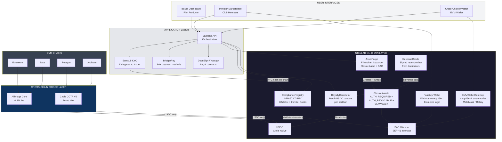
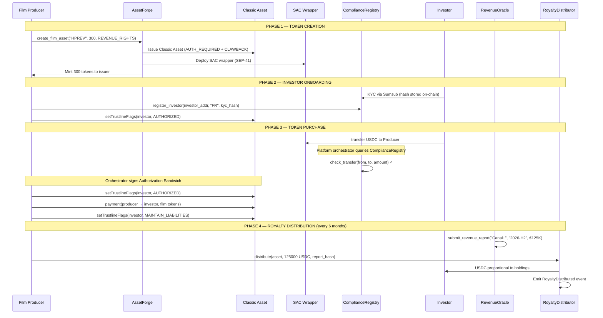
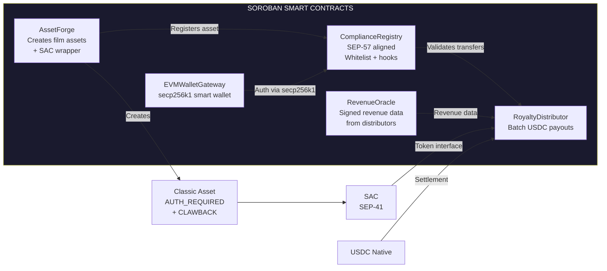
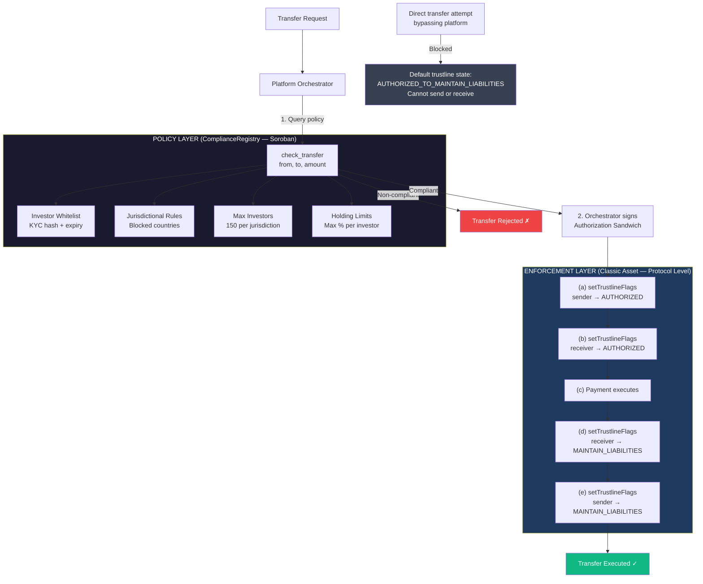
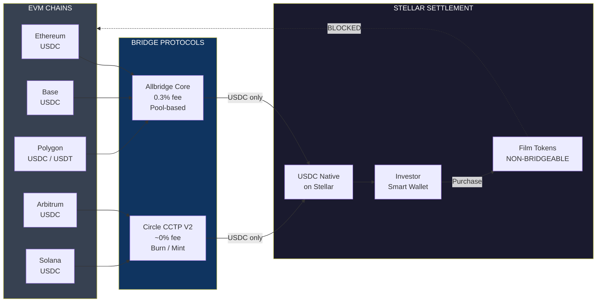
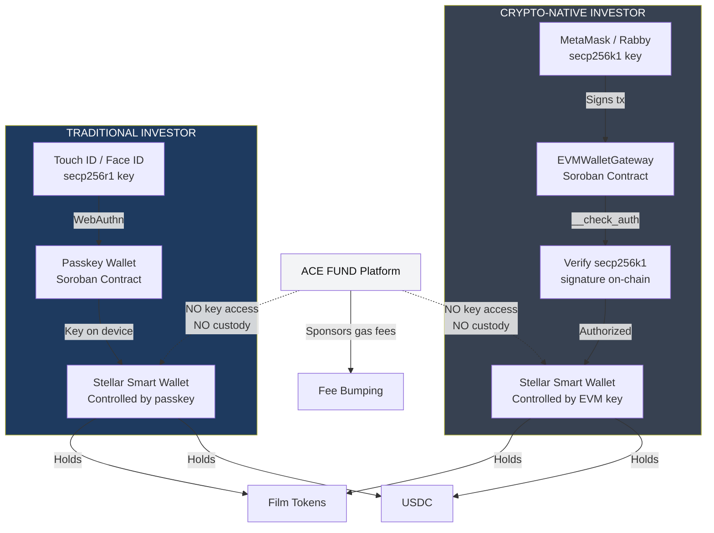
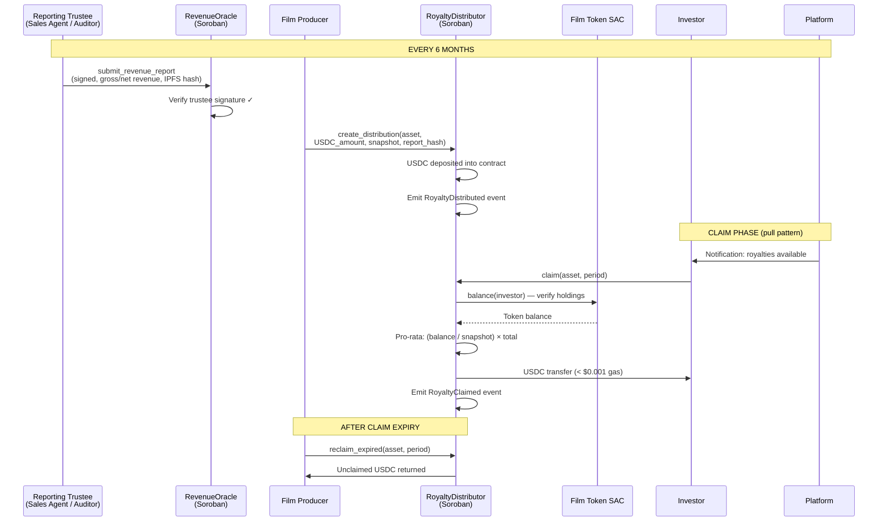
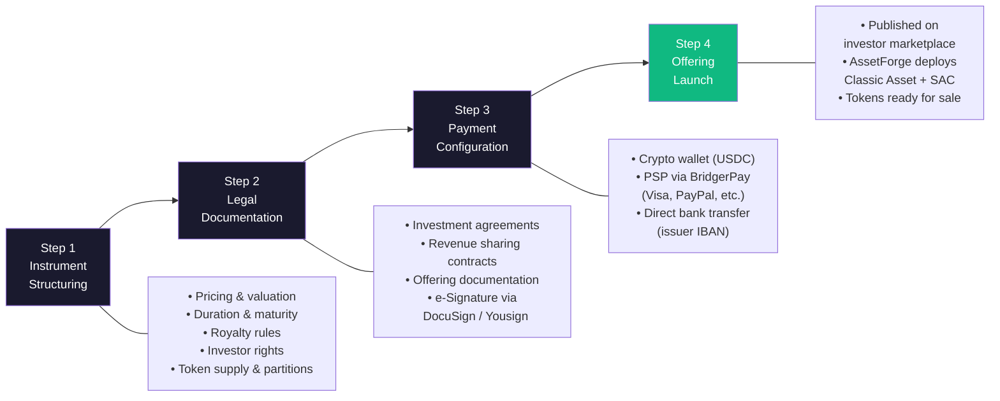
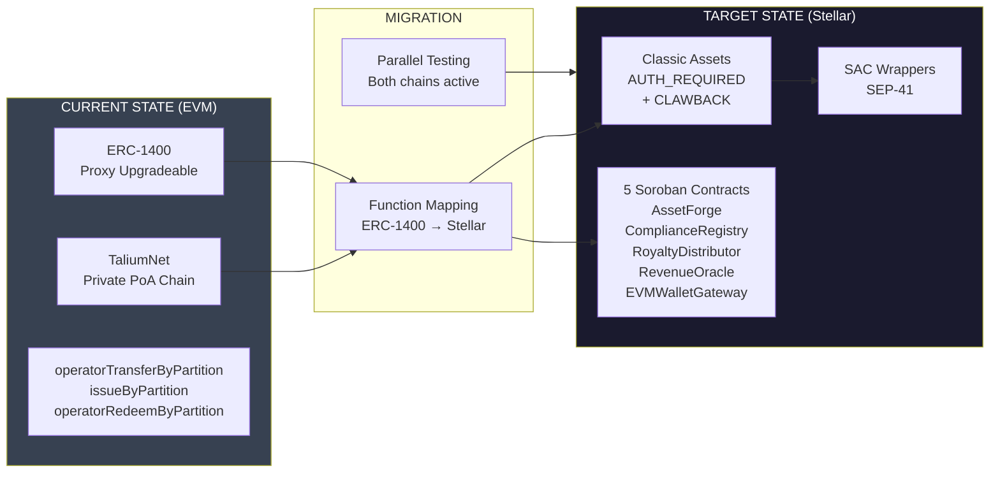

# Technical Architecture — ACE FUND

## Regulated Film Tokenization Rail on Stellar

---

**Project:** ACE FUND (by ACE Good)
**Category:** RWA — Tokenized Film Royalties & Revenue Rights
**Track:** Open Track — Build Award
**Website:** [acefund.io](https://www.acefund.io)

---

## Table of Contents

1. [Executive Summary](#1-executive-summary)
2. [Problem Statement](#2-problem-statement)
3. [Solution Overview](#3-solution-overview)
4. [Why Stellar](#4-why-stellar)
5. [Core On-Chain Architecture](#5-core-on-chain-architecture)
6. [Smart Contract Architecture](#6-smart-contract-architecture)
7. [Tokenization Flow](#7-tokenization-flow)
8. [Compliance Architecture](#8-compliance-architecture)
9. [Cross-Chain Liquidity Bridge](#9-cross-chain-liquidity-bridge)
10. [Wallet Architecture](#10-wallet-architecture)
11. [Royalty Distribution Engine](#11-royalty-distribution-engine)
12. [Off-Chain Infrastructure](#12-off-chain-infrastructure)
13. [Security Model](#13-security-model)
14. [DeFi Composability](#14-defi-composability)
15. [ERC-1400 → Stellar Migration Strategy](#15-erc-1400--stellar-migration-strategy)

---

## 1. Executive Summary

ACE FUND is a SaaS platform that enables film producers to tokenize revenue rights (royalties, box office receipts, TV distribution fees) and sell fractional ownership to investors. The platform has been operating on a private EVM chain (TaliumNet/Hyperledger Besu) since 2023, with **€1.2M+ in on-chain transactions** across 5 tokenized film projects, using the ERC-1400 security token standard.

This submission requests funding to **migrate and extend the tokenization infrastructure to Stellar**, replacing the private EVM chain with a public network while adding native compliance enforcement, cross-chain liquidity access, and automated royalty distribution via Soroban smart contracts.

**Key metrics:**
- €500K TV rights catalog tokenized (200 tokens × €2,500, 25%+ annual yield)
- €700K tokenized on a single film production (1.5M budget)
- 5 film projects tokenized, 15+ in pipeline
- CES Las Vegas 2024 Innovation Award
- Network of 100+ film directors and producers
- Invited speaker at the Academy of Motion Pictures (Oscars) and Cannes Film Festival

---

## 2. Problem Statement

Film financing relies on opaque, illiquid instruments accessible only to institutional investors or high-net-worth individuals. Independent producers with 10% funding gaps (typically €150K–€1.5M) have no efficient mechanism to reach retail investors.

**Current limitations on the private EVM chain:**

| Problem | Impact |
|---------|--------|
| Private PoA chain (TaliumNet) | No public verifiability, limited trust |
| No native stablecoin | Fiat on/off-ramp friction, no USDC settlement |
| Closed ecosystem | No access to DeFi liquidity or institutional capital pools |
| Third-party dependency | Talium operates the chain, ACE FUND has no sovereignty |
| EVM-only investors | Excludes Stellar-native institutional capital (Franklin Templeton, SG Forge, etc.) |

---

## 3. Solution Overview

Migrate from private EVM chain to Stellar public network using a hybrid Classic Asset + Soroban architecture.

### Global Architecture



### Film Token Lifecycle



---

## 4. Why Stellar

Stellar is not interchangeable with other chains for this use case. The following features are **structurally required** and either unavailable or prohibitively expensive on EVM chains:

### 4.1 Native Authorization Model

Film royalty tokens are regulated securities. Every transfer must be pre-approved by the issuer. Stellar's `AUTH_REQUIRED` flag enables this **at the protocol level**, not via a smart contract workaround:

- `AUTH_REQUIRED`: no wallet can hold tokens without explicit issuer approval
- `AUTH_REVOCABLE`: issuer can freeze tokens in case of regulatory action or investor non-compliance
- `AUTH_CLAWBACK_ENABLED`: issuer can recover tokens in case of fraud or court order — a legal requirement for securities in the EU

On Ethereum, these features require custom ERC-1400 logic that adds gas costs and attack surface. On Stellar, they are **native protocol operations** with zero additional complexity.

### 4.2 Authorization Sandwich Pattern

For per-transfer approval of regulated securities:

```
1. Issuer authorizes sender (AUTHORIZED_FLAG)
2. Issuer authorizes receiver (AUTHORIZED_FLAG)
3. Payment executes
4. Issuer revokes receiver to AUTHORIZED_TO_MAINTAIN_LIABILITIES
5. Issuer revokes sender to AUTHORIZED_TO_MAINTAIN_LIABILITIES
```

Each transfer is individually approved. This is the exact regulatory model required for securities transfers under MiFID II. On Stellar, this is a native 5-operation atomic transaction. On EVM, it requires custom hooks, modifiers, and gas-intensive state changes.

### 4.3 Classic Asset + SAC: Best of Both Worlds

- **Classic Asset issuance**: native, gas-efficient (~$0.00001/tx), with built-in authorization and clawback
- **SAC (Stellar Asset Contract)**: wraps the Classic Asset to expose the SEP-41 token interface to Soroban, enabling composability with smart contract logic (compliance hooks, distribution, oracle)
- This dual layer is unique to Stellar: **protocol-level security + smart contract programmability**

### 4.4 Native USDC

Circle issues USDC **directly on Stellar** — not wrapped, not bridged, fully native. This enables:
- Zero-bridge-risk settlement in USDC
- Royalty distributions directly in USDC to investor wallets
- Fiat off-ramp via Stellar anchors (MoneyGram, local partners) in 100+ countries
- CCTP V2 for native cross-chain USDC transfers (burn/mint, no wrapped tokens)

### 4.5 Cost Structure

Royalty distributions require batch payments to hundreds of investors every 6 months. At Stellar's ~$0.00001/tx, distributing to 500 investors costs < $0.01. On Ethereum mainnet, the same operation costs $50–500+ depending on gas prices.

### 4.6 Institutional Ecosystem

Stellar hosts Franklin Templeton ($580M+ tokenized treasuries), SG Forge (EUR CoinVertible), PayPal (PYUSD). Film royalty tokens on Stellar sit alongside institutional-grade RWA — increasing credibility and access to institutional LP capital.

---

## 5. Core On-Chain Architecture

### 5.1 Asset Model

Each film or catalog is represented as a **Stellar Classic Asset** with the following issuer account configuration:

```
Issuer Account (per film)
├── AUTH_REQUIRED_FLAG         = true
├── AUTH_REVOCABLE_FLAG        = true
├── AUTH_CLAWBACK_ENABLED_FLAG = true
├── Home Domain                = acefund.io
└── Asset Code                 = e.g., HPRES (High Pressure), MDFCATALOG
```

The Classic Asset is then wrapped via SAC to expose the SEP-41 interface:

```bash
stellar contract asset deploy \
  --source <issuer_keypair> \
  --network mainnet \
  --asset HPRES:<issuer_public_key>
```

The issuer account's keypair is held by the **film producer** (the legal issuer of the securities), not by ACE FUND. ACE FUND provides the tooling; the producer retains sovereignty.

### 5.2 Partition Model (ERC-1400 Equivalent)

On the existing EVM platform, film tokens use ERC-1400 partitions to separate different tranches of the same film (e.g., "revenue rights" vs "IP rights"). On Stellar, partitions are implemented as **separate Classic Assets issued by the same issuer account**:

```
Film: "High Pressure" (Issuer: GFILM...)
├── HPREV (Revenue Rights) — 300 tokens × €5,000
├── HPCAT (Catalog Rights) — future tranche
└── Each asset: AUTH_REQUIRED + CLAWBACK + SAC wrapper
```

This preserves the ERC-1400 partition semantics while leveraging Stellar's native asset model. The `AssetForge` Soroban contract automates the creation and configuration of these asset partitions.

---

## 6. Smart Contract Architecture

Five core Soroban contracts orchestrate the on-chain lifecycle:

### 6.1 Contract Overview



### 6.2 AssetForge

**Purpose:** Automates the creation of film token partitions on Stellar.

**Functions:**

```rust
pub fn register_film_asset(
    env: Env,
    issuer: Address,          // Film producer (must authorize)
    asset_code: Symbol,       // e.g., "HPREV" (≤12 chars, Symbol for type safety)
    sac_address: Address,     // SAC address (deployed separately via CLI)
    total_supply: i128,       // e.g., 300 tokens
    partition_type: Symbol,   // REVENUE_RIGHTS | CATALOG_RIGHTS | IP_RIGHTS
    metadata_hash: BytesN<32> // IPFS hash of legal contract
) -> Result<(), AssetForgeError> {
    issuer.require_auth();
    // Registers the film asset in the on-chain registry
    // Links SAC address to metadata for downstream contracts
}

pub fn get_film_assets(
    env: Env,
    issuer: Address
) -> Vec<FilmAsset>;
// Returns all partitions for a given film issuer
```

**Important:** Creating a Stellar Classic Asset and setting issuer flags (`AUTH_REQUIRED`, `AUTH_REVOCABLE`, `AUTH_CLAWBACK_ENABLED`) are **Stellar Classic operations**, not Soroban contract calls. These are executed off-chain via the Stellar SDK/CLI before the SAC is deployed. The `register_film_asset()` function registers an already-created Classic Asset + SAC pair in the on-chain registry, linking it to metadata for use by ComplianceRegistry and RoyaltyDistributor.

**Issuance workflow:**
1. **Off-chain (Stellar CLI/SDK):** Create issuer account → set flags → issue Classic Asset → deploy SAC wrapper
2. **On-chain (AssetForge):** `register_film_asset()` records the asset in the contract registry with metadata

**Storage:** Persistent storage maps `issuer → Vec<FilmAsset>` where `FilmAsset` includes asset code, SAC address, total supply, partition type, and creation timestamp.

### 6.3 ComplianceRegistry (SEP-57 / T-REX Aligned)

**Purpose:** On-chain policy registry for investor whitelist and transfer restriction rules. Aligned with the T-REX framework (ERC-3643 adapted to Stellar via SEP-57, currently in draft).

**Important architectural clarification:** The ComplianceRegistry is a **policy oracle**, not an in-line enforcement hook on SAC transfers. The Stellar Asset Contract (SAC) is auto-generated wrapper code that exposes the SEP-41 interface for an underlying Classic Asset — it is not extensible and does not call external contracts on transfer. The actual on-chain enforcement gate is the **Authorization Sandwich pattern** (see §8.2), where the issuer's `AUTH_REQUIRED` flag controls every transfer at the protocol level. The ComplianceRegistry is consulted by the platform orchestrator **before** the sandwich is signed.

**Design:**

```rust
pub fn register_investor(
    env: Env,
    issuer: Address,         // Only the film producer can register
    investor: Address,       // Stellar address (Account or Contract)
    jurisdiction: Symbol,    // ISO 3166-1 country code
    kyc_hash: BytesN<32>,   // Hash of KYC verification result
    expiry: u64             // KYC validity timestamp
) -> Result<(), ComplianceError> {
    issuer.require_auth();
    // ...
}

pub fn revoke_investor(
    env: Env,
    issuer: Address,
    investor: Address
) -> Result<(), ComplianceError> {
    issuer.require_auth();
    // ...
}

pub fn check_transfer(
    env: Env,
    asset: Address,          // SAC address of the film token
    from: Address,
    to: Address,
    amount: i128
) -> Result<(), ComplianceError>;
// Called by the platform orchestrator BEFORE signing the Authorization Sandwich.
// Verifies:
// 1. Both sender and receiver are whitelisted
// 2. Receiver's KYC has not expired
// 3. Jurisdictional restrictions are respected
// 4. Max investor count per asset is not exceeded (150/jurisdiction)
// 5. Holding limits are respected
// Returns Ok(()) if compliant, Err(ComplianceError) with specific reason if not.

pub fn is_whitelisted(
    env: Env,
    investor: Address,
    asset: Address
) -> bool;

pub fn get_investor_count(
    env: Env,
    asset: Address,
    jurisdiction: Symbol
) -> u32;
// Returns number of registered investors per jurisdiction
// Used to enforce the 150-investor private placement limit
```

**Compliance Rules (configurable per asset):**

| Rule | Description | Default |
|------|-------------|---------|
| `max_investors_per_jurisdiction` | EU Prospectus Regulation limit | 150 |
| `max_holding_pct` | Maximum % of total supply per investor | 10% |
| `blocked_jurisdictions` | Sanctioned countries (OFAC, EU) | Configurable |
| `kyc_expiry_days` | KYC validity period | 365 days |
| `transfer_cooldown` | Minimum holding period | 0 (configurable) |

**Enforcement model — Authorization Sandwich + Policy Oracle:**

The ComplianceRegistry works in tandem with the issuer's `AUTH_REQUIRED` flag via the **Authorization Sandwich pattern**. The flow for every regulated transfer is:

1. **Default state:** All investor trustlines are set to `AUTHORIZED_TO_MAINTAIN_LIABILITIES` — investors can hold tokens but **cannot send or receive** without explicit issuer approval per transfer.
2. **Transfer request:** The platform orchestrator receives a transfer request and calls `ComplianceRegistry.check_transfer()` to verify policy compliance.
3. **If compliant:** The orchestrator constructs and submits a 5-operation atomic transaction (the Authorization Sandwich):
   - (a) `setTrustlineFlags(sender, AUTHORIZED_FLAG)` — temporarily authorize sender
   - (b) `setTrustlineFlags(receiver, AUTHORIZED_FLAG)` — temporarily authorize receiver
   - (c) `payment(sender → receiver, amount)` — execute the transfer
   - (d) `setTrustlineFlags(receiver, AUTHORIZED_TO_MAINTAIN_LIABILITIES)` — revoke receiver
   - (e) `setTrustlineFlags(sender, AUTHORIZED_TO_MAINTAIN_LIABILITIES)` — revoke sender
4. **If non-compliant:** The orchestrator rejects the transfer. No sandwich is signed. The `ComplianceError` variant is returned to the caller (expired KYC, blocked jurisdiction, investor cap reached, etc.).

**Why this model works:** The protocol-level `AUTH_REQUIRED` flag is the **binding on-chain enforcement gate** — no transfer can execute without the issuer's signature on the sandwich. The ComplianceRegistry provides the **policy logic** that determines whether the issuer should sign. This separation means:

- **No bypass possible:** Even if an investor attempts a direct Classic Asset payment (bypassing the platform), the transfer fails because their trustline is in `AUTHORIZED_TO_MAINTAIN_LIABILITIES` state — sending is blocked at the protocol level.
- **Peer-to-peer transfers on Stellar DEX are blocked by design:** The default trustline state prevents offers and direct payments. All transfers must go through the platform orchestrator.
- **Granular policy enforcement:** Classic Assets alone cannot express jurisdiction limits, investor caps, or KYC expiry — the ComplianceRegistry adds this business logic layer that the orchestrator consults before signing.

### 6.4 RoyaltyDistributor

**Purpose:** Manages royalty distribution in USDC to all token holders of a given film asset, proportional to their holdings.

**Distribution model — Pull pattern (claim-based):**

The SAC does not expose a holder enumeration API (`get_all_holders()` does not exist). The RoyaltyDistributor uses a **pull pattern**: the issuer deposits the total USDC into the contract for a given period, and each investor claims their pro-rata share. This design:

- Removes the need for on-chain holder enumeration
- Eliminates batching limits (no 200-write-entry constraint per transaction)
- Shifts gas costs to the claiming investor (sponsored by the platform via fee bumping)
- Handles "lost" investors gracefully (unclaimed amounts revert to issuer after a configurable expiry)
- Scales cleanly over a 30–40 year distribution horizon

**Functions:**

```rust
pub fn create_distribution(
    env: Env,
    issuer: Address,              // Must authorize
    asset: Address,               // SAC address of the film token
    period: Symbol,               // e.g., "2026-H1"
    total_usdc: i128,             // Total USDC deposited for this period
    total_supply_snapshot: i128,  // Total token supply at snapshot
    revenue_report_hash: BytesN<32>, // Hash of signed revenue report
    claim_expiry: u64             // Ledger number after which unclaimed funds revert
) -> Result<(), DistributionError> {
    issuer.require_auth();
    // 1. Transfers total_usdc from issuer to the contract
    // 2. Records distribution parameters (period, total, snapshot, expiry)
    // 3. Emits RoyaltyDistributed event
}

pub fn claim(
    env: Env,
    investor: Address,            // Must authorize
    asset: Address,
    period: Symbol
) -> Result<i128, DistributionError> {
    investor.require_auth();
    // 1. Verifies investor has not already claimed for this period
    // 2. Reads investor's film token balance via SAC.balance(investor)
    // 3. Calculates pro-rata: (balance / total_supply_snapshot) * total_usdc
    // 4. Transfers USDC from contract to investor
    // 5. Records claim (prevents double-claim)
    // 6. Emits RoyaltyClaimed event
    // Returns: USDC amount claimed
}

pub fn reclaim_expired(
    env: Env,
    issuer: Address,
    asset: Address,
    period: Symbol
) -> Result<i128, DistributionError> {
    issuer.require_auth();
    // After claim_expiry: returns unclaimed USDC to issuer
}

pub fn get_distribution(
    env: Env,
    asset: Address,
    period: Symbol
) -> Option<Distribution>;

pub fn get_claimable(
    env: Env,
    investor: Address,
    asset: Address,
    period: Symbol
) -> i128;
// Returns the USDC amount claimable by this investor (0 if already claimed)

pub fn get_investor_earnings(
    env: Env,
    investor: Address,
    asset: Address
) -> i128;
// Cumulative USDC claimed by this investor across all periods
```

**Distribution events:**

```rust
#[contractevent]
pub struct RoyaltyDistributed {
    #[topic]
    asset: Address,
    #[topic]
    period: Symbol,              // e.g., "2026-H1"
    total_usdc: i128,
    total_supply_snapshot: i128,
    revenue_hash: BytesN<32>,
}

#[contractevent]
pub struct RoyaltyClaimed {
    #[topic]
    asset: Address,
    #[topic]
    investor: Address,
    period: Symbol,
    usdc_amount: i128,
}
```

**Snapshot mechanism:** The `total_supply_snapshot` is recorded at distribution creation time. The contract uses `SAC.balance(investor)` at claim time to verify the investor's current holdings. For the MVP, the snapshot is the balance at claim time (last-holder-gets-paid model). A future evolution may implement block-height snapshots via an indexed off-chain snapshot service, passed as a Merkle proof to the contract.

**Cost structure:** Each claim is a single Soroban transaction (~1 cross-contract call to SAC + 1 USDC transfer). At Stellar's fee structure, cost per claim is < $0.001. For 300 investors, the platform can auto-trigger claims via fee-bumped transactions, providing a push-like UX while using the pull architecture underneath.

### 6.5 RevenueOracle

**Purpose:** On-chain publication of verified revenue data for each film asset. Provides investors with an independently verifiable link between off-chain film revenues and on-chain distribution payouts.

**Reporting Trustee model:**

In practice, film distributors (Canal+, Arte, Netflix) do not interact with blockchain systems. They send periodic revenue statements to the producer or its sales agent under existing contractual obligations. The RevenueOracle uses a **reporting trustee** model:

1. **Distributors** send revenue statements to the producer/sales agent (standard industry process — accounting statements every 6 months).
2. **A designated reporting trustee** — typically the sales agent, the producer's legal counsel, or a third-party chartered film accountant — receives, validates and aggregates these statements.
3. The trustee signs the aggregated revenue figure and uploads supporting documentation to IPFS.
4. The trustee submits the signed report on-chain via `submit_revenue_report()`.

The trustee is the only entity registered as an authorized reporter in the contract. Distributors are not on-chain participants.

**Functions:**

```rust
pub fn submit_revenue_report(
    env: Env,
    trustee: Address,             // Designated reporting trustee
    asset: Address,               // Film token SAC address
    period: Symbol,               // "2026-H1"
    gross_revenue: i128,          // In cents (EUR or USD)
    net_distributable: i128,      // After deductions
    report_hash: BytesN<32>,      // IPFS hash of full report + supporting docs
) -> Result<(), OracleError> {
    trustee.require_auth();
    // Verifies trustee is an authorized reporter for this asset
    // Stores report data in persistent storage
    // Emits RevenueReported event
}

pub fn add_authorized_trustee(
    env: Env,
    admin: Address,               // Contract admin (issuer)
    trustee: Address,
    name: Symbol,                 // e.g., "Cabinet_Dupont_CAC"
    qualification: Symbol         // e.g., "CAC_FR" (Commissaire aux Comptes)
) -> Result<(), OracleError> {
    admin.require_auth();
    // Registers a reporting trustee for one or more film assets
}

pub fn get_latest_report(
    env: Env,
    asset: Address
) -> Option<RevenueReport>;

pub fn get_cumulative_revenue(
    env: Env,
    asset: Address
) -> i128;
```

**Revenue report structure:**

```rust
pub struct RevenueReport {
    pub trustee: Address,
    pub period: Symbol,
    pub gross_revenue: i128,
    pub net_distributable: i128,
    pub report_hash: BytesN<32>,  // IPFS hash of aggregated report + source docs
    pub timestamp: u64,
}
```

**Trust model:**

| Role | Entity | On-Chain? | Responsibility |
|------|--------|-----------|----------------|
| **Distributor** | Canal+, Arte, Netflix, etc. | No | Sends revenue statements to producer/sales agent per contractual obligations |
| **Reporting Trustee** | Sales agent, legal counsel, or chartered accountant (CAC) | Yes — registered via `add_authorized_trustee()` | Aggregates, validates, signs and submits revenue data on-chain |
| **Producer (Issuer)** | Film production company | Yes — admin | Designates the reporting trustee at asset creation; can replace trustee |
| **Investors** | Token holders | No (passive consumers) | Can query reports on-chain; contractual audit rights against the trustee |

**Trustee qualifications:** The producer designates one reporting trustee per film at issuance, identified in the legal contract. For films with large distribution amounts (> €1M per period), a dual-trustee model is recommended: two authorized trustees must both submit concordant reports before the distribution is triggered.

**Dispute mechanism:** Investors who believe reported revenue is incorrect have contractual recourse via audit rights against the trustee (specified in the investment agreement). This is a legal mechanism, not an on-chain feature, but the on-chain report provides the auditable reference point.

### 6.6 EVMWalletGateway

**Purpose:** Smart wallet contract that enables investors with EVM wallets (MetaMask, Rabby) to interact with Stellar without managing a separate Stellar keypair.

**Mechanism:**

```rust
impl CustomAccountInterface for EVMWalletGateway {
    type Signature = BytesN<65>; // secp256k1 signature (r, s, v)
    type Error = GatewayError;

    fn __check_auth(
        env: Env,
        signature_payload: BytesN<32>,
        signature: Self::Signature,
        auth_context: Vec<Context>,
    ) -> Result<(), Self::Error> {
        // 1. Recover the secp256k1 public key from the signature
        // 2. Derive the Ethereum address (keccak256 of pubkey)
        // 3. Verify it matches the registered EVM address
        // 4. Verify the signature covers the correct payload
    }
}

pub fn register(
    env: Env,
    evm_address: BytesN<20>,     // 0x... Ethereum address
    proof: BytesN<65>            // Signature proving ownership
) -> Address;
// Creates a new smart wallet contract instance
// Returns the Stellar contract address (C...)
// The EVM private key is the ONLY signer — self-custody

pub fn get_stellar_address(
    env: Env,
    evm_address: BytesN<20>
) -> Option<Address>;
```

**Self-custody guarantee:** The smart wallet contract can ONLY be operated by producing a valid secp256k1 signature from the registered Ethereum address. ACE FUND never has access to any private key. The investor signs transactions with MetaMask/Rabby, and the `__check_auth` function verifies the signature on-chain.

---

## 7. Tokenization Flow

### 7.1 Film Onboarding (Issuer Side)

```
Producer (Issuer)
      │
      ▼
1. Creates account on ACE FUND platform
2. Uploads legal documentation (revenue sharing contract, film budget)
3. Signs via DocuSign/Yousign
      │
      ▼
4. ACE FUND generates a Stellar keypair for the issuer
   (or links existing Stellar account)
5. AssetForge.create_film_asset() is called:
   - Creates Classic Asset with AUTH_REQUIRED + CLAWBACK
   - Deploys SAC wrapper
   - Registers asset metadata (IPFS hash of legal contract)
   - Mints total supply to issuer account
      │
      ▼
6. Film is listed on the ACE FUND marketplace
   Tokens are ready for sale
```

### 7.2 Investment Flow (Investor Side)

**Stellar-native or traditional investor:**

```
Investor
   │
   ▼
1. Creates account (email + passkey)
   → Soroban passkey wallet created automatically (WebAuthn)
   → Private key stored on device (Touch ID / Face ID)
   → Self-custody, ACE FUND has no key access
   │
   ▼
2. KYC via Sumsub (delegated to film producer)
   → On success: ComplianceRegistry.register_investor()
   → Investor's Stellar address whitelisted on-chain
   → Issuer sets trustline AUTHORIZED_FLAG
   │
   ▼
3. Payment: fiat via BridgerPay → on-ramp to USDC via Stellar anchor
   or: USDC on Stellar directly
   │
   ▼
4. Purchase: investor sends USDC to issuer, issuer transfers film tokens
   → Platform orchestrator calls ComplianceRegistry.check_transfer()
   → If compliant: orchestrator signs the Authorization Sandwich
     (authorize sender → authorize receiver → payment → revoke both)
   → Transfer executes as a single atomic transaction
   → Tokens arrive in investor's passkey wallet
```

**EVM-native investor:**

```
EVM Investor (MetaMask / Rabby)
   │
   ▼
1. Connects EVM wallet on ACE FUND platform
   → EVMWalletGateway.register() creates a Soroban smart wallet
   → Wallet is controlled by the investor's EVM private key (secp256k1)
   → Self-custody: no one else can sign transactions
   │
   ▼
2. KYC via Sumsub → ComplianceRegistry.register_investor()
   (same as above, using the Stellar smart wallet address)
   │
   ▼
3. Bridge USDC from EVM chain to Stellar:
   → Integrated Allbridge Core or Circle CCTP V2 in platform UI
   → Investor signs the bridge transaction with MetaMask (source chain)
   → USDC arrives on their Stellar smart wallet
   │
   ▼
4. Purchase: same Authorization Sandwich flow
   → Investor signs USDC payment with MetaMask
   → EVMWalletGateway.__check_auth() verifies secp256k1 signature
   → Platform orchestrator validates via ComplianceRegistry
   → Orchestrator signs the sandwich for the film token transfer
```

---

## 8. Compliance Architecture

### 8.1 Regulatory Framework

ACE FUND operates under the **EU private placement exemption** (Regulation EU 2017/1129):

| Requirement | Implementation |
|-------------|----------------|
| < 150 investors per EU Member State | `ComplianceRegistry.max_investors_per_jurisdiction` enforced on-chain |
| < €8M total consideration per 12 months | Tracked off-chain per issuer; on-chain cap configurable |
| No public solicitation | Private club model (membership required) |
| KYC/AML verification | Sumsub integration, delegated to issuer (producer) |
| Self-custody (no custody license required) | Passkey wallets (WebAuthn) + EVMWalletGateway (secp256k1) |

**ACE FUND's regulatory position:** ACE FUND is a **technology provider** (SaaS platform), not an investment intermediary. The film producer is the legal issuer of the securities and bears KYC/AML responsibility. ACE FUND provides the infrastructure (smart contracts, marketplace UI, KYC SDK integration) but does not hold tokens, funds, or investor data.

**Broader regulatory landscape:** Film royalty tokens granting a stream of revenue rights are likely to qualify as transferable securities under MiFID II (Annex I, Section C). MiCA (Regulation EU 2023/1114) applies to crypto-assets that are not MiFID II instruments — since film tokens are likely MiFID II instruments, MiCA does not apply to the tokens themselves but may apply to ancillary services. ACE FUND's non-custodial design and the fact that only USDC (not film tokens) is bridged limit MiCA exposure. A formal legal opinion on the MiFID II / MiCA boundary is being obtained during the project.

### 8.2 On-Chain Compliance Enforcement

**Authorization Sandwich + Policy Oracle model:**



**How the two layers interact:**

- **Layer 1 (Protocol — Classic Asset flags):** The binding on-chain enforcement gate. All investor trustlines default to `AUTHORIZED_TO_MAINTAIN_LIABILITIES` — investors can hold tokens but cannot send or receive without the issuer signing an Authorization Sandwich per transfer. This is a **native Stellar protocol operation** with zero smart contract overhead. Any attempt to transfer tokens directly (Stellar DEX, peer-to-peer payment, or bypassing the platform) **fails at the protocol level**.

- **Layer 2 (Policy — ComplianceRegistry contract):** The granular business logic that determines whether the issuer should authorize a given transfer. Classic Assets alone cannot express jurisdiction caps, KYC expiry, or holding limits. The ComplianceRegistry encodes these rules on-chain, queryable by the orchestrator before each sandwich is signed.

**Defense in depth:** Even if the orchestrator's policy check is somehow bypassed (e.g., compromised API), the protocol-level `AUTH_REQUIRED` flag still blocks any unauthorized transfer. Conversely, even if an investor's trustline were somehow authorized, the ComplianceRegistry provides an auditable on-chain record of whether the transfer should have been permitted.

### 8.3 Token Bridgeability Restriction

Film royalty tokens are **non-bridgeable by design**. The `AUTH_REQUIRED` flag prevents any wallet (including bridge contracts) from holding tokens without explicit issuer approval. Bridge contracts will never be whitelisted in the `ComplianceRegistry`.

**Only USDC is bridgeable.** Investors can bridge liquidity IN (USDC from any chain → Stellar) and bridge liquidity OUT (USDC from Stellar → any chain). The security tokens remain on Stellar at all times, under full compliance enforcement. CCTP V2 (Circle's native burn/mint) is recommended over Allbridge Core (pool-based) wherever the source chain supports it, as it carries materially lower counterparty risk.

### 8.4 Data Privacy (GDPR)

On-chain data is pseudonymous: Stellar addresses + KYC hashes. PII (name, identity documents, residency proof) is held off-chain in encrypted storage by the issuer (OVH Cloud, EU data residency).

- **Article 17 (right to erasure):** Satisfied by deleting the off-chain link between the Stellar address and the investor's legal identity. The on-chain record (address + hash) becomes orphan and non-attributable. Erasure does not retroactively delete on-chain transfer history — this is disclosed to investors at onboarding and accepted in the shareholder agreement.
- **Data retention:** PII is held only for the duration required by AML/accounting/contractual obligations (typically 5–10 years post-position-close), then deleted.

### 8.5 AML / Travel Rule

- **Issuer AML/CTF program:** Transaction monitoring, suspicious activity reporting, and sanctions screening are delegated obligations under the SaaS framing — the film producer (issuer) is the responsible entity. The platform provides tooling (Sumsub transaction monitoring, flagging rules) but does not make compliance decisions.
- **Sanctions screening:** Performed at onboarding and re-screened on an ongoing basis (daily automated re-screening against OFAC / EU consolidated sanctions list).
- **Travel Rule (EU TFR 2023/1113):** Film royalty tokens are likely MiFID II instruments, not crypto-assets under MiCA, so TFR may not apply to the tokens themselves. However, USDC flows on the platform are subject to Travel Rule obligations. BridgerPay handles fiat-side compliance; crypto-side Travel Rule compliance is handled via Sumsub Travel Rule integration for transfers above €1,000.

---

## 9. Cross-Chain Liquidity Bridge

### 9.1 Architecture



**Direction:** USDC flows IN for investment, OUT for distributions/exit. Film tokens are **non-bridgeable** — they remain on Stellar under full compliance enforcement at all times.

### 9.2 Supported Routes

| Source Chain | Bridge | Token | Status |
|-------------|--------|-------|--------|
| Ethereum | Allbridge Core | USDC, USDT | Live |
| Base | Allbridge Core | USDC | Live |
| Polygon | Allbridge Core | USDC, USDT | Live |
| Arbitrum | Allbridge Core | USDC | Live |
| Solana | Allbridge Core | USDC | Live |
| Any CCTP chain | Circle CCTP V2 | USDC (native) | Q1 2026 |

### 9.3 User Experience

The bridge is **embedded in the ACE FUND platform UI**. The investor does not interact with Allbridge or CCTP directly:

1. Investor clicks "Deposit from EVM" in the ACE FUND dashboard
2. MetaMask/Rabby popup asks to approve USDC transfer on source chain
3. Platform routes the transfer through Allbridge Core or CCTP V2
4. Trustline for USDC on Stellar is automatically established if needed
5. USDC arrives on the investor's Stellar wallet within 1-5 minutes
6. Investor can immediately purchase film tokens

---

## 10. Wallet Architecture

### 10.1 Wallet Architecture Overview



### 10.2 Two Wallet Types

| Type | User Profile | Technology | Signer | Custody |
|------|-------------|------------|--------|---------|
| **Passkey Wallet** | Traditional investor (club member) | Soroban smart wallet + WebAuthn (secp256r1) | Device biometrics (Touch ID / Face ID) | Self-custody |
| **EVM Gateway Wallet** | Crypto-native investor | Soroban smart wallet + secp256k1 verification | EVM private key (MetaMask/Rabby) | Self-custody |

### 10.3 Passkey Wallet Flow

Leverages Stellar's Protocol 21 secp256r1 verification for WebAuthn-compatible authentication:

- No seed phrase, no private key management for the user
- Authentication via fingerprint, Face ID, or hardware security key
- Gas fees sponsored by the platform (fee bumping)
- Wallet creation is invisible — user signs up with email, wallet exists in background

### 10.4 EVM Gateway Wallet Flow

The `EVMWalletGateway` contract implements the `CustomAccountInterface`:

- User connects MetaMask/Rabby once to register their EVM address
- A Soroban smart wallet is deployed, with the EVM address as sole signer
- All subsequent Stellar transactions are signed via MetaMask
- The `__check_auth` function recovers the secp256k1 public key and verifies ownership

**Key property:** The EVM private key is the sole signer. If the user loses access to their MetaMask, they lose access to their Stellar wallet — same security model as any self-custody wallet. ACE FUND cannot recover or access the wallet.

**Post-grant evolution:** Guardian-based social recovery for passkey wallets (investor designates 2-3 guardians at onboarding; after a 7-day cooldown, a quorum can rotate the wallet's primary signer). Threshold signatures for issuer accounts to remove single-party orchestration dependency.

### 10.5 Operational Signing Architecture

The Authorization Sandwich pattern (§8.2) requires the issuer's signature on every approved transfer. For a portfolio of 200+ investors per film over a 30–40 year contract horizon, this implies an automated signing service. The signing architecture is designed to avoid a single point of failure while preserving the issuer's ultimate authority.

**Recommended multisig configuration (2-of-3):**

| Signer | Holder | Purpose |
|--------|--------|---------|
| **Key A** | Film producer (issuer) | Business authority — approves extraordinary operations (freeze, clawback, config changes) |
| **Key B** | Platform automation service | Operational — signs Authorization Sandwiches for routine compliant transfers |
| **Key C** | Independent trustee (e.g., reporting trustee or legal counsel) | Recovery + dispute resolution — co-signs if Key A or Key B is unavailable |

**Operational model:**
- **Routine transfers:** Key B (platform automation) + Key A (producer auto-approval via delegated signing rule) sign the sandwich. Target latency: < 30 seconds from transfer request to settlement.
- **Producer unavailable:** Key B + Key C can authorize transfers, ensuring liveness even if the producer is unreachable. The trustee co-signs under a pre-agreed service agreement.
- **Platform offline:** Key A + Key C can authorize transfers directly, removing platform dependency.
- **Extraordinary operations** (freeze, clawback, config change): require Key A (producer) explicitly — the platform automation key alone is never sufficient.

**Regulatory framing:** The platform's automated signing (Key B) operates under the issuer's instructions per a signed service agreement. The issuer retains ultimate authority via Key A. This preserves the "SaaS technology provider" positioning — the platform executes the issuer's compliance policy, it does not make independent transfer decisions.

---

## 11. Royalty Distribution Engine

### 11.1 Distribution Process

Film royalties are distributed every 6 months for a duration of 30-40 years per film contract:



### 11.2 Revenue Guarantee Mechanism

ACE FUND structures each film tokenization with a **priority repayment waterfall**:

1. **First revenues** are allocated to token holders until initial investment + 25% is repaid
2. **Subsequent revenues** are split according to the contractual percentage (e.g., 10% to token holders)
3. **Tax credit mechanism** (CNC France: 30%, Tax Shelter Belgium: 45%): 12 months post-production, tax credits are released to the producer, who allocates a portion to repay investors

This waterfall is encoded in the legal contract (off-chain, signed via DocuSign). The on-chain component is the `RoyaltyDistributor` that executes the distributions as determined by the `RevenueOracle` data.

---

## 12. Off-Chain Infrastructure

### 12.1 Components

| Component | Technology | Purpose |
|-----------|------------|---------|
| **Backend API** | Node.js / Java | Orchestration, issuer management, marketplace logic |
| **KYC SDK** | Sumsub API (primary, live) | Identity verification (delegated to issuer). Veriff available as fallback per issuer preference |
| **Legal Signing** | DocuSign / Yousign | Revenue sharing contracts, investor agreements |
| **Payment Gateway** | BridgerPay | 80+ payment methods (Visa, PayPal, bank transfer, crypto) |
| **Direct Bank Transfer** | Issuer IBAN | Fiat payments sent directly to issuer's bank account (non-custodial) |
| **Cap Table Engine** | Backend database | Real-time ownership tracking per asset partition, dividend rights, investor registry, shareholder agreement enforcement |
| **Hosting** | OVH Cloud (EU) | GDPR-compliant, EU data residency |
| **IPFS** | Pinata / Infura | Legal contract storage, revenue report archives |

### 12.2 Issuer Workflow (SaaS Dashboard)

The platform provides a 4-step workflow for film producers to create and launch a tokenized offering:



**Key design choice:** Payment flows are configured so that funds transfer **directly from investor to issuer** (via BridgerPay, crypto wallet, or bank transfer). The platform never holds or intermediates funds. This is fundamental to the non-custodial architecture.

### 12.3 Cap Table Management

The platform maintains a real-time cap table for each tokenized film asset, synchronized between on-chain and off-chain state:

| Data Point | Source | Purpose |
|------------|--------|---------|
| Token balances (current) | Stellar ledger (SAC `balance()`) | Authoritative ownership record |
| Investor identity | Off-chain database (KYC records) | Maps Stellar addresses to verified identities |
| Distribution history | Stellar ledger (USDC transfers) | Cumulative dividends per investor |
| Shareholder agreements | IPFS (hash on-chain) | Legal contract backing each token position |
| Transaction history | Stellar ledger + off-chain logs | Full audit trail with tx hashes linked to investor records |

The cap table engine reconciles on-chain balances with off-chain investor records, ensuring that the issuer always has an accurate view of ownership, dividend rights, and compliance status. Transaction hashes from every on-chain operation are stored in the off-chain database and linked to the relevant investor, asset, and compliance records — enabling end-to-end auditability.

**Reconciliation architecture:**
- **Real-time event ingestion:** Stellar RPC subscription on `getEvents` / `streamEvents` for SAC transfer events, ComplianceRegistry events, and RoyaltyDistributor events. Retry and back-fill logic for missed events.
- **Daily full-snapshot reconciliation:** Nightly job queries Horizon for all trustline balances per asset and compares against the off-chain cap table. Mismatches are flagged for manual review.
- **Source of truth:** On-chain ledger is authoritative for token balances. Off-chain database is authoritative for PII (investor identity, KYC records). Reconciliation flags any divergence between expected (off-chain) and actual (on-chain) state.

### 12.4 Data Separation

| Data | Storage | Reason |
|------|---------|--------|
| Token balances, transfers | Stellar ledger | On-chain verifiability |
| Investor whitelist, KYC hashes | Soroban contract (ComplianceRegistry) | On-chain compliance enforcement |
| Revenue reports (summary) | Soroban contract (RevenueOracle) | On-chain auditability |
| Distribution history | Stellar ledger (USDC transfers) | On-chain transparency |
| Investor PII (name, ID docs) | OVH Cloud (encrypted, issuer-controlled) | GDPR, data privacy |
| Cap table, ownership tracking | Backend database + Stellar ledger | Reconciled on/off-chain |
| Legal contracts (full text) | IPFS (hash on-chain) | Immutability + availability |
| Film metadata, marketing | Backend database | Operational data |
| Payment records, reconciliation | Backend database | Operational audit trail |

---

## 13. Security Model

### 13.1 Key Management

| Actor | Key Type | Storage | Risk Mitigation |
|-------|----------|---------|-----------------|
| Film producer (issuer) | Stellar keypair | Producer's custody | Multisig 2-of-3 (see §10.4) |
| Investor (passkey) | secp256r1 | Device secure enclave | WebAuthn standard |
| Investor (EVM) | secp256k1 | MetaMask/Rabby | EVMWalletGateway contract |
| Platform operations | Stellar keypair | HSM / KMS | Fee sponsoring only, no asset control |

### 13.2 Attack Surface Analysis

| Threat | Mitigation |
|--------|------------|
| Unauthorized token transfer | AUTH_REQUIRED + ComplianceRegistry whitelist (two-layer) |
| Platform compromise | Non-custodial: platform has no access to investor keys or funds |
| Issuer key compromise | Optional multisig on issuer account; clawback enables recovery |
| Bridge exploit (USDC) | Only USDC is bridgeable; film tokens are non-bridgeable by design |
| Revenue oracle manipulation | Reporting trustee model with contractual qualifications; dual-trustee for large distributions (> €1M) |
| Smart contract vulnerability | Soroban Security Audit Bank (provided by SCF post-T3) |

### 13.3 Authorization & Clawback Policy

`AUTH_REVOCABLE` and `AUTH_CLAWBACK_ENABLED` serve different purposes and have different legal implications:

| Action | Mechanism | Effect | When Used |
|--------|-----------|--------|-----------|
| **Freeze** | `setTrustlineFlags(AUTHORIZED_TO_MAINTAIN_LIABILITIES)` | Investor retains tokens but cannot send or receive | Regulatory investigation, AML flag, KYC expiry, temporary compliance hold |
| **Clawback** | `clawback(investor, amount)` via SAC | Tokens forcibly returned to issuer | Court order, fraud, regulatory seizure, investor death/succession |

**Operational policy:**
- **Freeze is the default response** to compliance issues — reversible, proportionate, preserves investor rights pending resolution.
- **Clawback is a last resort** — irreversible, requires documented legal basis (court order, regulatory directive). Clawback events are logged on-chain and disclosed to all investors per the shareholder agreement.
- Both operations require multisig authorization (Key A + Key B or Key A + Key C per §10.4). The platform automation key alone cannot freeze or clawback.

### 13.4 Upgrade Path

All Soroban contracts are upgradeable via the `upgrade()` function, gated by admin authorization:

```rust
pub fn upgrade(env: Env, new_wasm_hash: BytesN<32>) {
    let admin: Address = env.storage().instance().get(&DataKey::Admin).unwrap();
    admin.require_auth();
    env.deployer().update_current_contract_wasm(new_wasm_hash);
}
```

Upgrade authority is held by the contract admin (initially ACE FUND, transferable to a multisig or DAO). A system event `["executable_update", old, new]` is emitted on every upgrade for auditability.

---

## 14. DeFi Composability

### 14.1 Future Integration Paths (Post-Grant)

Film royalty tokens, once established on Stellar, can integrate with the existing DeFi ecosystem:

| Protocol | Integration | Value |
|----------|-------------|-------|
| **Blend Protocol** | Film tokens as collateral for USDC borrowing | Investors can access liquidity without selling tokens |
| **Soroswap / Aquarius** | USDC/Film-token trading pairs | Secondary market liquidity |
| **DeFindex** | Vault strategy wrapping multiple film tokens | Diversified film investment product |

**Note:** DeFi integrations require solving the KYC constraint — only whitelisted investors can hold film tokens. Possible approaches include permissioned pools (whitelist-gated) or synthetic tokens. This is out of scope for this grant but represents a natural evolution.

### 14.2 Secondary Market

Film tokens can be traded on compliant secondary market platforms. ACE FUND is in discussion with two regulated secondary market operators (one on Cardano, one on Base). On Stellar, peer-to-peer transfers between whitelisted investors are natively supported via the `ComplianceRegistry.check_transfer()` hook.

---

## 15. ERC-1400 → Stellar Migration Strategy

### Migration Overview



The milestone roadmap and budget are detailed in the SCF application document.

### Legacy Holder Migration (TaliumNet)

Existing token holders on TaliumNet (MAD Films Coin — MDF, 25 transactions, €1.2M+ tokenized) have legal entitlements that must be preserved through the migration.

**Migration approach — Parallel operation, then forward-only:**

- **Existing positions remain on TaliumNet.** Current token holders retain their ERC-1400 positions and continue receiving distributions via the existing infrastructure. No forced migration.
- **New issuances go to Stellar.** All new film tokenizations (starting with the first grant-funded film) are issued on Stellar from day one.
- **Optional migration path for existing holders:** Investors who wish to migrate receive new Stellar Classic Asset tokens in exchange for burned ERC-1400 tokens. The swap is 1:1, attested by the issuer, and requires investor consent (DocuSign).
- **Legal continuity:** Confirmation from counsel that the migrated token represents the same legal instrument (same revenue rights, same contractual terms). This is documented per investor in the shareholder agreement.
- **Communications plan:** Existing investors and producers are notified of the Stellar migration with a clear explanation of their options (stay on TaliumNet, migrate to Stellar, or hold both for future issuances).

This parallel approach avoids disrupting existing investors while proving the Stellar infrastructure on new issuances.

---

## Appendix A — Existing Traction

### On-Chain Activity (TaliumNet / Hyperledger Besu)

| Metric | Value |
|--------|-------|
| Contract | MAD Films Coin (MDF) — ERC-1400 proxy upgradeable |
| Address | `0x0AA38721612b083eB8Ba17C9291449044C92A948` |
| Standard | ERC-1400 (Security Token with partitions) |
| Transactions | 25 confirmed (Jan 2025 — Apr 2026) |
| Functions called | `operatorTransferByPartition` (16x), `issueByPartition` (4x), `operatorRedeemByPartition` (2x), `transferByPartition` (1x) |
| Explorer | [TaliumNet Explorer](https://eth.talium.fr/address/0x0AA38721612b083eB8Ba17C9291449044C92A948) |

### Tokenized Assets

| Project | Type | Amount | Status |
|---------|------|--------|--------|
| TV Series Catalog (80 territories: Canal+, Arte, Al Jazeera, Radio-Canada) | Revenue rights | €500,000 (200 × €2,500) | Active, 25%+ annual yield |
| High Pressure (French-Spanish production, €15M budget) | Revenue rights | €700,000 | Active, 1.5M tokenized tranche |
| Independent Film (recurring director) | Revenue rights | €21,000+ | Active since Jan 2026 |
| 2 additional films | Revenue rights | Various | Listed |
| **Pipeline** | Various | **15+ films** | In preparation |

### Recognition

- **CES Las Vegas 2024** — Innovation Award for film tokenization model
- **Academy of Motion Pictures** (Oscars) — Invited for tokenization partnership
- **Cannes Film Festival** — Invited speaker
- **CES Las Vegas 2026** — Invited speaker on film tokenization

### Team

| Name | Role | Background |
|------|------|------------|
| Grégory Monfort | CEO | 15+ years in audiovisual production. Founded ACE Good (2021) and ACE Fund. Network of 100+ film directors/producers worldwide. |
| François de Chezelles | CTO | 25+ years IT, MSc MIT. Co-founder of Talium (blockchain ESN, 2012). 100+ tokenization operations. Built the ERC-1400 framework used by ACE Fund. |
| Mehdi Terbeche | Investor Relations | Investment structuring background. Private equity experience. |
| Alicya Mendes | COO | 15+ years in operations and business development. |
| Jacques Soucquières | CFO | Former Crédit Foncier asset manager. Traditional finance background. |

---

## Appendix B — ERC-1400 to Stellar Migration Reference

| ERC-1400 Function | Stellar Equivalent |
|--------------------|--------------------|
| `issueByPartition(bytes32, address, uint256, bytes)` | `AssetForge.create_film_asset()` + `mint()` via SAC |
| `operatorTransferByPartition(bytes32, address, address, uint256, bytes, bytes)` | Classic Asset `payment` op with Authorization Sandwich + `ComplianceRegistry.check_transfer()` |
| `operatorRedeemByPartition(bytes32, address, uint256, bytes, bytes)` | `clawback()` via SAC or `burn()` by holder |
| `transferByPartition(bytes32, address, uint256, bytes)` | SEP-41 `transfer()` via SAC (gated by AUTH_REQUIRED + ComplianceRegistry) |
| `balanceOfByPartition(bytes32, address)` | SEP-41 `balance()` on partition-specific SAC |
| `partitionsOf(address)` | `AssetForge.get_film_assets()` per issuer |
| `isOperator(address, address)` | Stellar account signers / multisig |
| `authorizeOperator(address)` | `setOptions` (add signer to issuer account) |
| `canTransfer(bytes32, address, address, uint256, bytes)` | `ComplianceRegistry.check_transfer()` |

---

## Appendix C — SEP Alignment

| SEP | Usage in ACE FUND |
|-----|-------------------|
| **SEP-10** | Web Authentication for investor login (challenge-response, JWT) |
| **SEP-41** | Token Interface for all film assets via SAC |
| **SEP-57** | T-REX compliance framework: ComplianceRegistry hooks, investor whitelist, transfer restrictions. *Note: SEP-57 is currently a draft proposal. Architecture designed to be compatible with the final standard.* |
| **SEP-6/24** | Fiat on/off-ramp via Stellar anchors for traditional investors |
| **SEP-1** | stellar.toml declaration of film assets and issuer information |
